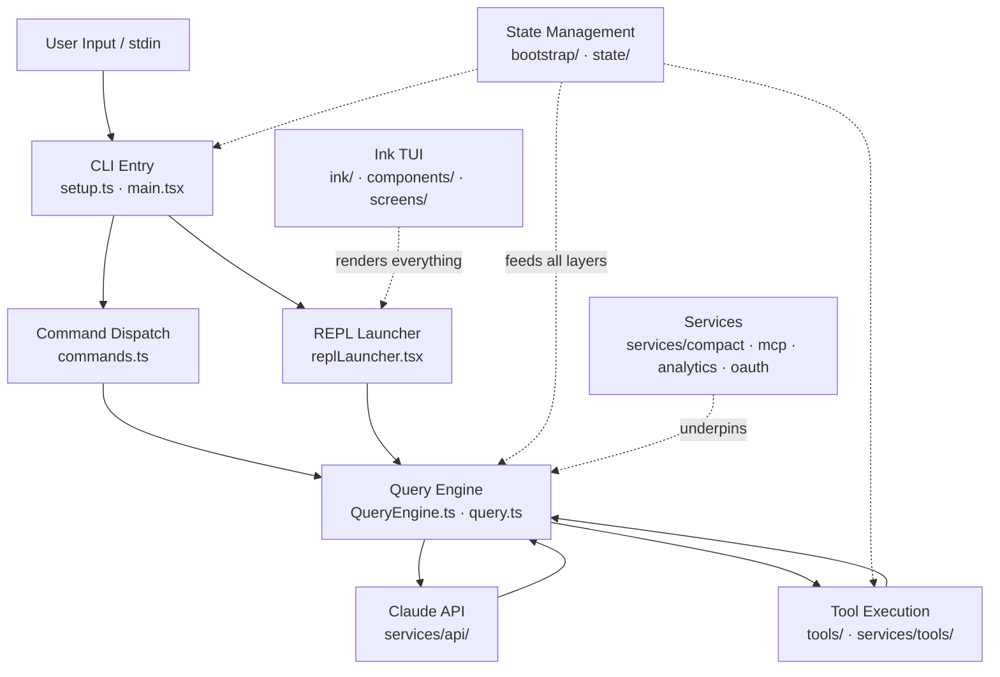
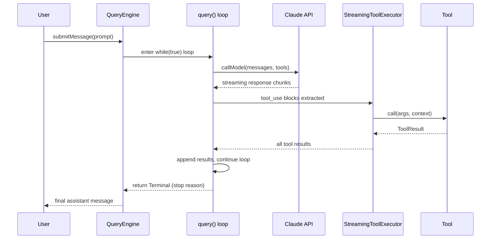
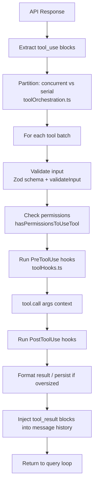
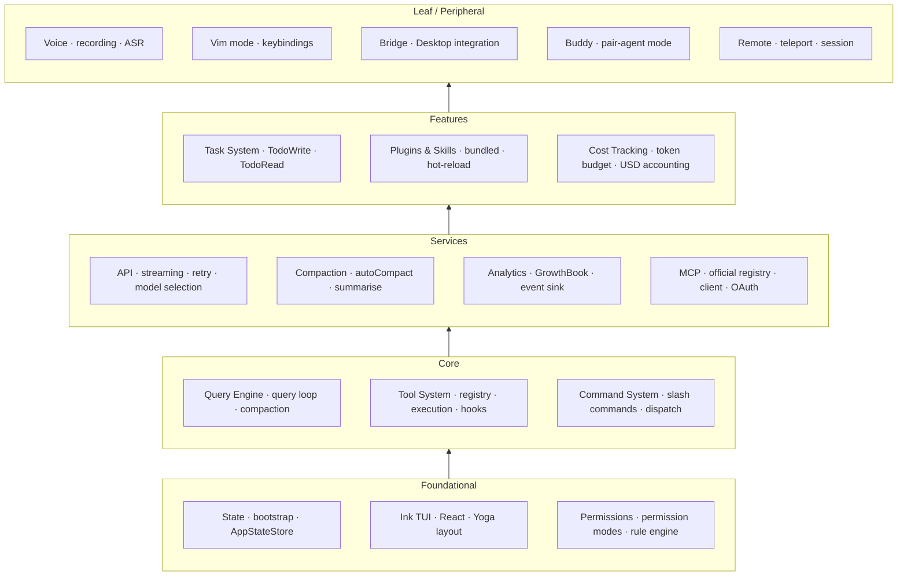

# Architecture Overview

Claude Code is an AI-powered command-line interface that pairs the Claude language model with a rich set of tools — file reads and writes, shell execution, web search, code editing, and more — so that a developer can delegate multi-step engineering tasks directly from the terminal. This wiki documents a reconstructed build of Claude Code v2.1.88, assembled from browser-cached source maps into a 4,756-module TypeScript application. The reconstruction is substantially complete but carries the caveats described in [reconstruction fidelity](reconstruction-fidelity.md). This page is the narrative spine of the wiki: it explains how the major subsystems fit together so you can dive into any area with a mental map already in place.

---

## 1. High-Level Architecture



When a user types a message and presses Enter, control begins in `main.tsx`. Before the first React render, `main.tsx` has already fired three parallel warm-up probes (startup profiler checkpoint, MDM raw-read subprocess, keychain prefetch) to shave latency from the critical path. The `setup()` function in `setup.ts` then runs: it validates the Node.js version, establishes the working directory, captures the hooks configuration snapshot, starts the optional UDS messaging socket for agent-swarm teammates, initialises session memory, registers attribution hooks, drains queued analytics events, and finally emits the `tengu_started` beacon that anchors session success-rate metrics.

After setup, the CLI dispatches to one of two paths depending on whether the invocation is interactive or headless. For interactive sessions, `launchRepl()` in `replLauncher.tsx` dynamically imports the `App` wrapper and the `REPL` screen and hands them to the Ink renderer. The `App` component owns the nine React context providers (see Section 4); the `REPL` screen is the interactive conversation surface. For headless invocations — `--print`, SDK calls, or scripted pipes — the `QueryEngine` is driven directly without a TUI. Both paths converge on the same `query()` loop described in the next section. For the full conversation lifecycle, see the [query engine](query-engine.md) page; for how individual tools are invoked once the model responds, see the [tool system](tool-system.md) page.

---

## 2. The Conversation Loop



Every user turn starts by calling `submitMessage()` on the `QueryEngine` instance, which is scoped to the session. `QueryEngine` owns the growing message list, the `AbortController` that can cancel a turn in flight, and the running cost and token-usage accumulators. The actual model-calling logic lives in `query()` / `queryLoop()` — a `while(true)` loop that drives one or more model calls per turn. On each iteration it assembles the current message list into an API request (including the memoized system prompt from `context.ts`), calls the model, and streams back the response.

The loop exits when the model returns `stop_reason: "end_turn"` with no tool-use blocks in the response, or when the turn is terminated by a hard limit (max turns, cost cap, or user abort). A stop-hooks pass runs after each model response before the next iteration: it checks TeammateIdle and TaskCompleted lifecycle hooks, fires prompt suggestions and memory extraction as fire-and-forget side effects, and decides whether to continue or yield a `Terminal` result back to the caller.

Compaction sits inside the loop as a guard before each new model call. If the conversation's token count approaches the model's context window — governed by `autoCompactIfNeeded()` and its configurable threshold — the loop summarises older messages into a compact representation using `compactConversation()`, resets the message list to `buildPostCompactMessages()`, and continues from the new shorter context. This is transparent to the user and to tools. See the [query engine](query-engine.md) page for the full `BudgetTracker`, compaction thresholds, and token-budget auto-continue logic.

---

## 3. Tool Execution Lifecycle



When the model returns a response containing `tool_use` blocks, `StreamingToolExecutor` takes over. It classifies each requested tool as either concurrent-safe or serial (tools declare this via the `isReadonly` and `isConcurrent` flags). Concurrent tools — typically read-only operations like file reads, searches, and web fetches — run in parallel using a `TrackedTool` state machine with sibling-abort: if any one Bash tool in a concurrent batch errors, the others are aborted. Serial tools run one at a time, in order.

Before each tool executes, it passes through a layered permission pipeline. First, `hasPermissionsToUseTool()` evaluates the active permission mode and any matching allow/deny rules loaded from `settings.json` at both project and global scope. If the mode is `default`, any rule that is not explicitly allowed triggers an interactive user prompt queued through the REPL's permission dialog. `bypassPermissions` mode auto-approves everything except deny rules and a hard-coded list of protected paths (`.git/`, `.claude/`, shell config files). The `auto` mode (internal/ant-only) runs a side-query to an AI classifier that can approve or deny without user interaction. See the [permissions](permissions-security.md) page for the full rule-matching algorithm, classifier race logic, and mode cycling.

Before and after `tool.call()` runs, the hook system fires `PreToolUse` and `PostToolUse` shell hooks configured in `settings.json`. These hooks can override the permission decision (approve, deny, or request user input) and inject additional context into the result. Tool results larger than `DEFAULT_MAX_RESULT_SIZE_CHARS` (50 KB) are persisted to disk by `persistToolResult()` and referenced by path rather than inlined into the message list, keeping context-window usage under control. The fully formatted results are then injected back into the message history as `tool_result` blocks, and the query loop continues with the next model call. For the complete tool type anatomy and the full registry of built-in tools, see the [tool system](tool-system.md) page.

---

## 4. State Architecture

```mermaid
block-beta
    columns 1
    block:T1["Tier 1: Bootstrap (bootstrap/state.ts)<br/>Process-global singleton · pre-React · no circular deps<br/>Session ID · cwd · cost accumulators · telemetry handles · model override"]
    block:T2["Tier 2: AppStateStore (state/AppStateStore.ts)<br/>~60 fields · Store&lt;AppState&gt; · bridges imperative ↔ React<br/>Conversation messages · permission mode · UI flags · agent state"]
    block:T3["Tier 3: React Contexts (context/)<br/>9 providers · narrowly scoped UI concerns<br/>Stats · Notifications · FPS metrics · Mailbox · Modal · Overlay · PromptOverlay · QueuedMessage · Voice"]
```

State in Claude Code is divided across three tiers for principled reasons, not historical accident. Tier 1 — the bootstrap singleton in `bootstrap/state.ts` — exists because certain data must be available before React mounts and must be readable by deep utility code that cannot import React without creating circular dependency cycles. The session ID is generated at module-import time via `randomUUID()`; cost and token accumulators are written by the query loop and read at exit for analytics. This tier has no dependencies on application code and is therefore a leaf in the import DAG.

Tier 2 — `AppStateStore` — bridges the imperative query engine with the React render tree. It is a custom `Store<AppState>` with an `onChange` side-effect handler that fires whenever a field changes. The store's approximately 60 fields cover everything the UI needs to reflect the current turn: the messages list, streaming state, permission mode, active agents, notification queue, and a battery of feature-gate flags. React components read it via `useAppState()` and write it via `useSetAppState()`. The query loop, which is not React code, reads and writes the store through the `getAppState` / `setAppState` callbacks injected into `QueryEngine`.

Tier 3 — the nine React context providers — covers UI concerns that are either too narrow or too high-frequency to belong in the central store. `StatsProvider` manages in-process performance counters; `FpsMetricsProvider` tracks render frame rate for diagnostics; `MailboxProvider` is a cross-component message bus; `ModalContext` and `OverlayContext` coordinate Escape-key handling and size calculations between overlapping UI layers. Putting these in separate contexts avoids unnecessary re-renders of the full component tree. See the [state management](state-management.md) page for the full field tables, selector API, and `onChangeAppState` side-effect catalogue.

---

## 5. Module Dependency Map



The dependency map reads bottom-to-top: foundational modules are imported by everything above them; leaf modules import from the layers below and are imported by nothing else. **Foundational** subsystems — state, Ink TUI, and the permission engine — are the load-bearing walls of the application. You cannot understand any other subsystem without understanding these three. **Core** subsystems — the query engine, tool system, and command system — are the main loop of the application. They call into services and are called by the UI. **Services** — the API layer, compaction engine, analytics pipeline, and MCP client — provide reusable infrastructure consumed by core and features alike. **Features** — task tracking, plugin/skill loading, cost accounting — are built on top of stable service contracts and represent user-facing capabilities. **Leaf** subsystems — voice input, Vim mode, Desktop bridge, Buddy pair-agent, and remote/teleport mode — import from everything below but are imported by nothing above; you can read them in any order without needing a global mental model first.

To navigate this wiki systematically, follow the dependency order: start with [state management](state-management.md) to understand how data flows; then read [ink-tui](ink-tui.md) to understand the render layer; then [permissions-security](permissions-security.md) for the trust model. With that foundation in place, [query-engine](query-engine.md) and [tool-system](tool-system.md) will make complete sense. From there you can read [command-system](command-system.md), [service-layer](service-layer.md), [mcp-integration](mcp-integration.md), [plugin-skill-system](plugin-skill-system.md), [task-system](task-system.md), [cost-tracking](cost-tracking.md), and [peripheral-systems](peripheral-systems.md) in any order. The [component-layer](component-layer.md) and [command-catalog](command-catalog.md) / [tool-catalog](tool-catalog.md) pages are reference material best consulted on demand rather than read linearly.

---

## Reading Guide

If this is your first time in the codebase, the fastest path to productivity is:

1. **[Query Engine](query-engine.md)** — understand the conversation loop, compaction, and stop conditions. This single file (`query.ts`) is where the application spends most of its runtime.
2. **[Tool System](tool-system.md)** — understand the `Tool` type, the permission pipeline, and `StreamingToolExecutor`. Every feature of practical interest eventually runs through a tool call.
3. **[State Management](state-management.md)** — understand the three-tier model so you know where to look when a field is being read or written unexpectedly.
4. **[Permissions & Security](permissions-security.md)** — understand why tool calls sometimes block and how to reason about the trust model when writing new tools or hooks.

For understanding the codebase's provenance — why some modules are fully reconstructed and others are skeletal, how source maps were used, and what fidelity guarantees apply — read [reconstruction fidelity](reconstruction-fidelity.md). For understanding how the application is compiled from its 4,756 TypeScript modules into a single distributable binary, read [build system](build-system.md).
