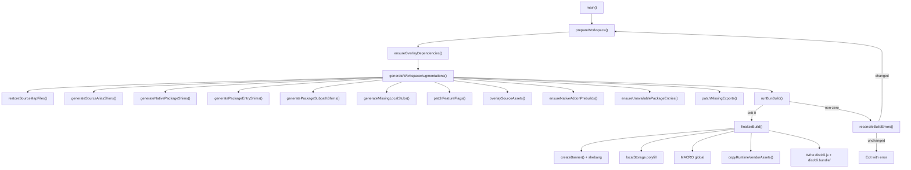

# Build System

> **Context.** This codebase is a community reconstruction of Claude Code v2.1.88, not Anthropic's original build tooling. The build script (`scripts/build-cli.mjs`, ~1,637 lines) reverse-engineers a runnable CLI from the published `cli.js.map` source map. It extracts TypeScript/JavaScript modules, reconciles missing dependencies, generates shims and stubs for unavailable internal packages, and bundles everything with Bun. If you are reading this for the first time, the key insight is that the build is not a conventional compile-from-source workflow — it is a **reconstruction pipeline** that recovers, patches, and re-bundles previously compiled code.

---

## Key Files

| File | Purpose |
|------|---------|
| `scripts/build-cli.mjs` | The entire build script — extraction, shimming, stubbing, bundling, finalization |
| `source/cli.js.map` | Published source map containing 4,756 embedded modules |
| `source/package.json` | Package metadata (`@anthropic-ai/claude-code` v2.1.88) |
| `source/native-addons/` | Pre-built `.node` binaries (screen capture, input, sharp, audio) |
| `source/src/` | Overlay assets — hand-maintained `.md` skill files and source patches |
| `source/runtime-vendor/` | Vendor assets copied into the final bundle |
| `.cache/workspace/` | Extracted workspace (generated, gitignored) |
| `.cache/workspace/.prepared.json` | Marker file for source-map extraction cache |
| `.cache/workspace/.overlay-install.json` | Stamp file for overlay dependency install cache |
| `dist/cli.js` | Output wrapper script (shebang + polyfills + MACRO + import) |
| `dist/cli.bundle/` | Bun bundle output directory |

---

## Overview

The build pipeline has five conceptual stages:

1. **Extract** — Parse `cli.js.map` and write each of its 4,756 modules to disk as individual files in `.cache/workspace/`.
2. **Reconcile** — Install ~80 real npm packages as overlay dependencies to replace source-map-extracted copies that lack full package structures.
3. **Shim** — Generate proxy modules that wire up `src/` alias imports, native package redirects, package entry points, and subpath re-exports.
4. **Patch** — Replace `bun:bundle` feature flag imports with a local shim function, generate stubs for missing local modules, and fix conditional exports.
5. **Bundle** — Run `bun build` to produce a single ESM bundle, then wrap it with a shebang, `localStorage` polyfill, and `MACRO` global.

If the bundle step fails, the build retries up to 6 times, auto-discovering missing packages and missing exports from Bun's error output.



---

## Source Map Extraction

**Function:** `prepareWorkspace()`

The source map (`source/cli.js.map`) is a standard V3 source map with `sources` and `sourcesContent` arrays. Each entry is a relative path like `../src/entrypoints/cli.tsx` or `../node_modules/chalk/source/index.js`.

The extraction loop iterates over all 4,756 modules:

```
for (let index = 0; index < sourceMap.sources.length; index += 1)
```

For each module:

1. Strip the leading `../` prefix to get a workspace-relative path.
2. Call `shouldSkipSourceMapWrite()` — if the module belongs to an overlay-managed package (i.e., one of the ~80 npm packages we install fresh), skip it. This prevents stale source-map code from overwriting real npm-installed code.
3. Write the file to `.cache/workspace/<relativePath>`, creating directories as needed.
4. Track the written path in a `keepPaths` Set for later pruning.

After writing all modules, `prepareWorkspace()` runs the shim generators, writes `tsconfig.json` and `package.json` into the workspace, restores pinned overlay source map files (React production builds that must come from the source map, not npm), calls `ensureSharpPackageJson()`, and prunes any workspace files not in `keepPaths`.

### Caching

The marker file `.cache/workspace/.prepared.json` stores:

```json
{
  "builderVersion": 7,
  "sourceMapMtimeMs": <mtime>,
  "sourceMapSize": <bytes>,
  "version": "2.1.88"
}
```

If the marker exists and `builderVersion`, `sourceMapMtimeMs`, and `sourceMapSize` all match the current source map, extraction is skipped entirely. Delete `.prepared.json` to force a clean re-extraction.

### `shouldSkipSourceMapWrite()`

Extracts the package name from the relative path (e.g., `node_modules/chalk/source/index.js` yields `chalk`) and returns `true` if that package is in the overlay managed set. First-party source under `src/` always passes through.

---

## Overlay Dependency System

**Function:** `ensureOverlayDependencies()`

The source map contains npm package source code, but those files lack `package.json` metadata, `node_modules/` transitive deps, and native binaries. The overlay system installs ~80 real packages from npm to replace them.

The base list is defined in `baseOverlayDependencyPackages` — a sorted array of package names including `@anthropic-ai/sdk`, `@aws-sdk/*`, `@opentelemetry/*`, `react`, `chalk`, `zod`, `sharp`, `yaml`, and dozens more. Additional packages discovered during retry loops are accumulated in `extraOverlayPackages`.

### Stamp-based caching

The stamp file `.cache/workspace/.overlay-install.json` stores:

```json
{
  "packagesKey": "<JSON-stringified sorted package list>"
}
```

`ensureOverlayDependencies()` compares the stamp's `packagesKey` to the current desired list **and** verifies every package directory actually exists on disk. If both checks pass, the install is skipped.

### npm install flags

When an install is needed, it runs:

```
npm install --no-package-lock --ignore-scripts --no-audit --no-fund --legacy-peer-deps <packages...>
```

All flags are chosen for speed and to avoid side effects: no lockfile written, no post-install scripts, no audit, no fund notices, and legacy peer dep resolution to avoid conflicts.

---

## Shim Generation

Shims are small proxy modules that re-export from the real target file. The build generates four types.

### Proxy module template

All four shim types use `writeProxyModule()`, which writes:

```js
import * as module_0 from "<relative-path-to-target>";
export * from "<relative-path-to-target>";
export default module_0.default;
```

### 1. Source Alias Shims

**Function:** `generateSourceAliasShims()`

The original Claude Code source uses bare `src/` imports like `import { foo } from 'src/utils/bar'`. Node does not resolve these natively. This function creates a mirror of every file under `.cache/workspace/src/` inside `.cache/workspace/node_modules/src/`, so that `import 'src/foo'` resolves to `node_modules/src/foo.js`, which re-exports from `../../src/foo.ts`.

### 2. Native Package Shims

**Function:** `generateNativePackageShims()`

Three packages are wired to in-tree vendor source instead of npm:

| Package name | Target |
|---|---|
| `audio-capture-napi` | `vendor/audio-capture-src/index.ts` |
| `modifiers-napi` | `vendor/modifiers-napi-src/index.ts` |
| `color-diff-napi` | `src/native-ts/color-diff/index.ts` |

Each gets an `index.js` proxy in its `node_modules/` root.

### 3. Package Entry Shims

**Function:** `generatePackageEntryShims()`

Walks all packages under `node_modules/` that are **not** overlay-managed and **not** native-package targets. If a package directory exists (from source map extraction) but has no `index.js`, the function searches a prioritized list of candidate entry points (`src/index.ts`, `dist/index.js`, `lib/index.js`, etc. — 20+ candidates) and writes a proxy to the first one found.

### 4. Package Subpath Shims

**Function:** `generatePackageSubpathShims()`

Handles deep imports like `react/compiler-runtime` or `@opentelemetry/api/logs`. Scans all source files for bare specifiers, and for any specifier with a subpath that does not resolve directly, searches `dist/esm/`, `dist/`, `src/`, `lib/`, `esm/`, `cjs/`, and `source/` subdirectories of the package root. Two special cases are hardcoded in `specialPackageTargets`:

| Specifier | Maps to |
|---|---|
| `react/compiler-runtime` | `node_modules/react/cjs/react-compiler-runtime.production.js` |
| `react-reconciler/constants.js` | `node_modules/react-reconciler/cjs/react-reconciler-constants.production.js` |

---

## Stub Generation

**Function:** `generateMissingLocalStubs()`

When source-map modules import local files (relative or `src/`-aliased) that are missing from the source map, the build generates stub modules so the bundler does not fail.

### Discovery: `collectMissingLocalImports()`

Walks every source file under `.cache/workspace/src/` and regex-matches all `import`, `from`, `require()`, and dynamic `import()` specifiers. For relative and `src/`-prefixed imports, it attempts resolution via `resolveLike()` / `resolveExistingPath()`. If the target does not exist (or is itself an `AUTO-STUB`), it is collected into a `Map<targetPath, refs[]>`.

### Export inference: `inferStubExports()`

For each missing target, the function examines every importer to determine what exports are expected:

- Named imports (`{ foo, bar }`) are parsed from import clauses.
- Namespace imports (`* as ns`) need no explicit exports.
- Default imports set `hasDefault = true`.
- `require('...').foo` and `import('...').foo` member accesses are captured.
- Destructured dynamic imports (`const { x } = await import('...')`) are parsed.

If the target's basename is a valid identifier (and not `index`), it is also added as a named export.

### Value inference: `renderStubExpression()`

Each export name is mapped to a value based on naming patterns:

| Pattern | Example | Stub value |
|---|---|---|
| `is*` / `has*` / `should*` / `can*` | `isEnabled`, `hasFeature` | `(..._args) => false` |
| `get*` / `create*` / `build*` / `load*` / `parse*` / `find*` / `fetch*` / `read*` / `write*` / `launch*` / `normalize*` | `getConfig`, `createSession` | `__makeStub(name)` |
| `use*` | `useSettings` | `(..._args) => ({})` (React hook convention) |
| `*_NAME` | `TOOL_NAME` | `JSON.stringify(basename)` |
| `*Dialog` / `*Message` / `*Panel` / `*View` / etc. | `ConfirmDialog`, `HelpPanel` | `() => null` (React component) |
| `BROWSER_TOOLS` | — | `[]` |
| Anything else | — | `__makeStub(name)` |

### The `__makeStub` factory

Every generated stub module includes a Proxy-based factory at the top:

```js
const __makeStub = name => {
  const fn = (..._args) => undefined;
  return new Proxy(fn, {
    get(_target, prop) {
      if (prop === 'then') return undefined;
      if (prop === Symbol.toPrimitive) return () => 0;
      if (prop === 'toString') return () => `[stub ${name}]`;
      return __makeStub(`${name}.${String(prop)}`);
    },
    apply() { return undefined; },
    construct() { return {}; },
  });
};
```

This creates an infinitely chainable, callable, constructable proxy. Accessing any property returns another stub, calling it returns `undefined`, and `new`-ing it returns `{}`. The `then` trap returns `undefined` to prevent accidental promise-unwrapping. This lets deep property chains like `stub.foo.bar.baz()` resolve silently instead of throwing.

### Asset and declaration stubs

- `.md` / `.txt` files get a one-line text stub: `Stub asset for <filename>`.
- `.d.ts` files get: `// AUTO-STUB: generated declaration placeholder\nexport {}\n`.

---

## Feature Flag Patching

**Function:** `patchFeatureFlags()`

The original source imports a `feature()` function from `bun:bundle`, a Bun compile-time API that is not available in our reconstruction. The build replaces these imports with a local shim.

### Replacement

Every source file under `.cache/workspace/src/` is scanned for the pattern:

```
import { feature } from 'bun:bundle';
```

This is replaced with:

```js
const feature = (flag) => (["BUILDING_CLAUDE_APPS","BASH_CLASSIFIER","TRANSCRIPT_CLASSIFIER","CHICAGO_MCP"]).includes(flag);
```

The enabled set is controlled by `enabledBundleFeatures` near the top of `build-cli.mjs`. The README notes ~90 flags are available in the source (search for `feature('`). Only four are enabled by default.

---

## Bun Bundling

**Function:** `runBunBuild()`

After the workspace is fully prepared, the build invokes Bun:

```
bun build .cache/workspace/src/entrypoints/cli.tsx \
  --target=node \
  --format=esm \
  --loader=.md:text \
  --loader=.txt:text \
  --env=USER_TYPE* \
  --env=CLAUDE_CODE_VERIFY_PLAN* \
  --root=.cache/workspace \
  --outdir=dist/cli.bundle.tmp
```

Additional flags:
- `--minify` is added unless `--no-minify` was passed to the build script.

Environment variables injected:
- `USER_TYPE=external`
- `CLAUDE_CODE_VERIFY_PLAN=false`

The entry point is `src/entrypoints/cli.tsx`. Output goes to a `.tmp` directory that is atomically renamed on success.

---

## Build Retry Loop

**Function:** `main()` — 6-attempt loop with `reconcileBuildErrors()`

```js
for (let attempt = 0; attempt < 6; attempt += 1) {
    prepareWorkspace(getOverlayPackages());
    ensureOverlayDependencies(getOverlayPackages());
    generateWorkspaceAugmentations();

    const buildResult = runBunBuild();
    if (buildResult.status === 0) {
        finalizeBuild();
        return;
    }

    const changed = reconcileBuildErrors(buildResult.stderr);
    if (!changed) {
        // No new packages or exports discovered — fail
        process.exit(buildResult.status ?? 1);
    }
}
```

### `reconcileBuildErrors()`

Parses Bun's stderr for two classes of errors:

1. **Unresolved package specifiers** — `Could not resolve: "<specifier>"`. Extracts the root package name, skips builtins/relative/`src/`/`bun:`/`node:` specifiers and anything in `unavailableOverlayPackages`, then adds the package to `extraOverlayPackages` if it is not already managed.

2. **Missing named exports** — `No matching export in "<path>" for import "<name>"`. If the target file is an `AUTO-STUB`, the missing export name is added to `stubExportAugmentations` so the stub is regenerated with the additional export on the next attempt.

If either class produced changes, the function re-runs `ensureOverlayDependencies()` and `generateWorkspaceAugmentations()` before returning `true`, causing the outer loop to re-attempt the Bun build. If nothing changed, it returns `false` and the build fails.

---

## Finalization

**Function:** `finalizeBuild()`

After a successful Bun build, the output is wrapped and moved into place.

### Wrapper script (`dist/cli.js`)

The wrapper is a self-contained Node.js entry point that sets up the runtime environment before importing the bundle:

1. **Shebang + banner** — `createBanner()` writes `#!/usr/bin/env node` followed by the Anthropic copyright notice and version.

2. **`localStorage` polyfill** — A `Map`-backed implementation of the Web Storage API (`getItem`, `setItem`, `removeItem`, `clear`, `key`, `length`) is assigned to `globalThis.localStorage`. The original source uses `localStorage` for some state, which does not exist in Node.

3. **`MACRO` global** — `globalThis.MACRO` is frozen with compile-time constants:
   - `VERSION` — `"2.1.88"`
   - `BUILD_TIME` — ISO timestamp
   - `PACKAGE_URL` — `"@anthropic-ai/claude-code"`
   - `README_URL`, `ISSUES_EXPLAINER`, `FEEDBACK_CHANNEL` — documentation / support URLs
   - `NATIVE_PACKAGE_URL`, `VERSION_CHANGELOG` — `null`

4. **Bundle import** — `await import("./cli.bundle/src/entrypoints/cli.js")` loads the actual application.

### `copyRuntimeVendorAssets()`

Copies the contents of `source/runtime-vendor/` into the bundle at `dist/cli.bundle/src/entrypoints/vendor/`. These are pre-built assets that the application loads at runtime via `__dirname`-relative paths.

### Atomic swap

The bundle directory and wrapper file are written to `.tmp` paths and atomically renamed. The wrapper is `chmod 0o755` to make it directly executable.
