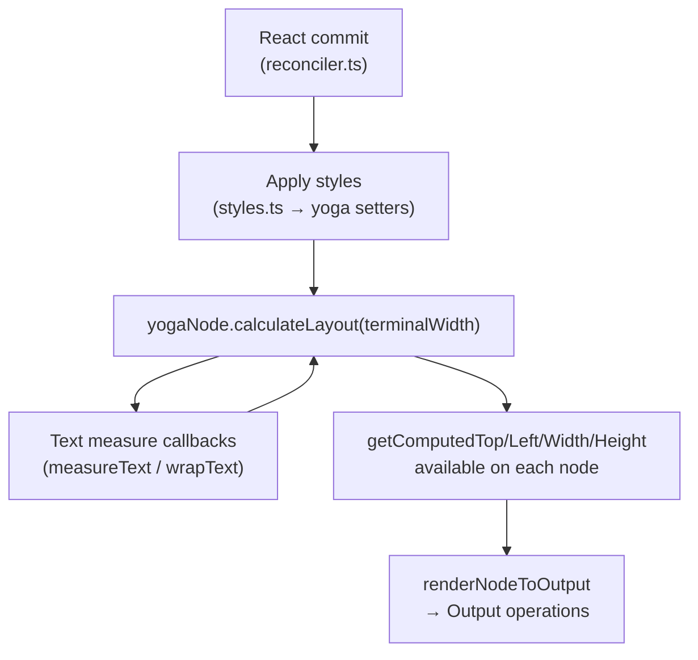
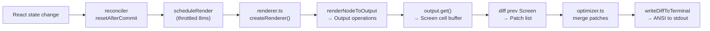
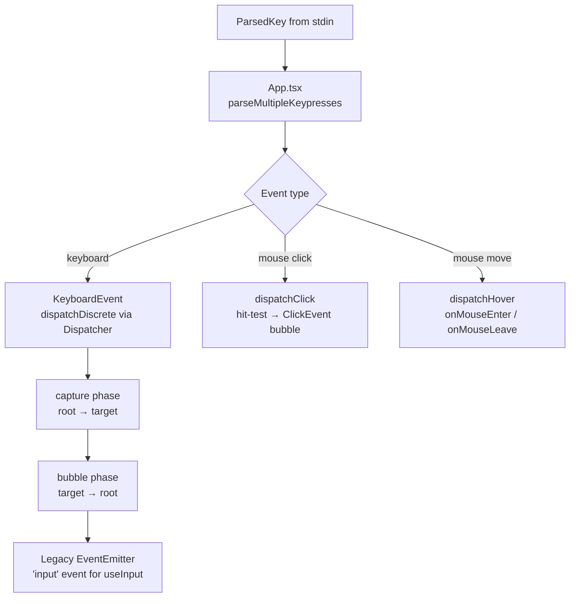
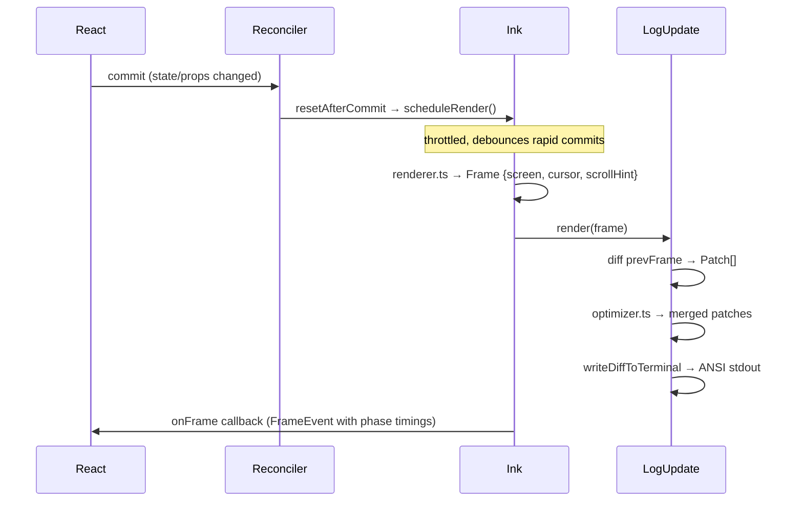

# Ink TUI

> Claude Code renders its terminal UI using a custom fork of [Ink](https://github.com/vadimdemedes/ink) — the library that brings React to the terminal. Where stock Ink targets simple CLI output, this fork adds mouse hit-testing, clickable OSC 8 hyperlinks, an alternate screen buffer with full mouse tracking, a Yoga-based flexbox layout engine, a DOM-style event system with capture/bubble phases, and a cell-diffing renderer that minimises terminal writes. See the [Architecture Overview](index.md) for where the TUI sits in the overall system.

---

## Key Files

### DOM & Virtual Tree

| File | Purpose |
|------|---------|
| `source/src/ink/dom.ts` | Virtual DOM node types (`DOMElement`, `TextNode`), tree mutations, dirty-marking |
| `source/src/ink/focus.ts` | `FocusManager` class — Tab/Shift+Tab cycling, click-to-focus, blur on unmount |
| `source/src/ink/styles.ts` | `Styles` and `TextStyles` type definitions; translates React props to Yoga API calls |
| `source/src/ink/node-cache.ts` | Per-frame rect cache keyed by `DOMElement`; consumed by hit-test and blit optimiser |

### Layout Engine

| File | Purpose |
|------|---------|
| `source/src/ink/layout/node.ts` | `LayoutNode` interface — engine-agnostic adapter for the Yoga API |
| `source/src/ink/layout/yoga.ts` | `YogaLayoutNode` — concrete adapter wrapping the TS Yoga port |
| `source/src/ink/layout/engine.ts` | `createLayoutNode()` factory; single indirection point for the layout backend |
| `source/src/ink/layout/geometry.ts` | `Point`, `Size`, `Rectangle`, `Edges` primitives and rect utilities |

### Rendering Pipeline

| File | Purpose |
|------|---------|
| `source/src/ink/render-node-to-output.ts` | DFS tree walk; emits `write`/`blit`/`clip`/`clear` operations into `Output` |
| `source/src/ink/output.ts` | `Output` class — accumulates operations then flushes into a `Screen` cell buffer |
| `source/src/ink/screen.ts` | `Screen` type; `StylePool`, `CharPool`, `HyperlinkPool`; cell-level diff |
| `source/src/ink/render-to-screen.ts` | Off-screen renderer used by search: renders a React element into an isolated `Screen` |
| `source/src/ink/renderer.ts` | `createRenderer()` — builds `Frame` objects (screen + cursor + scroll hint) |
| `source/src/ink/log-update.ts` | Diffs frames, serialises `Patch[]` → ANSI escape sequences, writes to stdout |
| `source/src/ink/optimizer.ts` | Merges/deduplicates `Patch[]` before terminal write |
| `source/src/ink/frame.ts` | `Frame`, `FrameEvent`, `Patch`, `Diff` types; `shouldClearScreen` logic |
| `source/src/ink/render-border.ts` | Border character sets and per-edge border rendering |

### Input System

| File | Purpose |
|------|---------|
| `source/src/ink/parse-keypress.ts` | Tokenizes raw stdin bytes into `ParsedKey`, `ParsedMouse`, `ParsedResponse` |
| `source/src/ink/hit-test.ts` | `hitTest()` + `dispatchClick()` + `dispatchHover()` for mouse events |
| `source/src/ink/termio/` | Low-level terminal control sequences (CSI, DEC private modes, OSC) |
| `source/src/ink/terminal-querier.ts` | Query/response machinery for XTVERSION, DA1, DECRQM probes |

### ANSI Handling

| File | Purpose |
|------|---------|
| `source/src/ink/colorize.ts` | `colorize()` + `applyTextStyles()` — chalk-based ANSI color/style emission |
| `source/src/ink/wrapAnsi.ts` | Thin shim: uses `Bun.wrapAnsi` when available, falls back to `wrap-ansi` npm |
| `source/src/ink/stringWidth.ts` | Terminal column-width of a string (Unicode-aware) |
| `source/src/ink/bidi.ts` | Bidirectional text reordering for RTL scripts |

### Components

| File | Purpose |
|------|---------|
| `source/src/ink/components/App.tsx` | Root class component — stdin raw mode, key parsing, mouse dispatch, focus events |
| `source/src/ink/components/Box.tsx` | Flex container; all `Styles` props; onClick/onFocus/onKeyDown/onMouseEnter |
| `source/src/ink/components/Text.tsx` | Inline text with colour, weight, wrap modes |
| `source/src/ink/components/Button.tsx` | Focusable, keyboard-activatable control with render-prop state |
| `source/src/ink/components/Link.tsx` | OSC 8 hyperlink when supported; plain-text fallback |
| `source/src/ink/components/AlternateScreen.tsx` | Enters DEC alt-screen buffer + optional SGR mouse tracking |
| `source/src/ink/components/ScrollBox.tsx` | Scrollable viewport with sticky-scroll and virtual-scroll support |
| `source/src/ink/components/Spacer.tsx` | `flexGrow: 1` spacer |
| `source/src/ink/components/Newline.tsx` | Explicit line break |
| `source/src/ink/components/RawAnsi.tsx` | Pre-rendered ANSI string injected directly into the cell buffer |

### Hooks

| File | Purpose |
|------|---------|
| `source/src/ink/hooks/use-input.ts` | Subscribe to raw keyboard input; manages stdin raw mode |
| `source/src/ink/hooks/use-app.ts` | Access `AppContext` (exposes `exit()`) |
| `source/src/ink/hooks/use-stdin.ts` | Access `StdinContext` (stream + event emitter) |
| `source/src/ink/hooks/use-animation-frame.ts` | Shared animation clock; pauses when element is off-screen |
| `source/src/ink/hooks/use-interval.ts` | Shared-clock interval and timer utilities |
| `source/src/ink/hooks/use-terminal-viewport.ts` | Detects whether an element is inside the visible terminal rows |
| `source/src/ink/hooks/use-terminal-focus.ts` | Reports whether the terminal window has OS focus (DECSET 1004) |
| `source/src/ink/hooks/use-terminal-title.ts` | Declaratively sets the terminal tab/window title via OSC 0 |
| `source/src/ink/hooks/use-tab-status.ts` | Sets the iTerm2/WezTerm tab-status dot via OSC 21337 |
| `source/src/ink/hooks/use-declared-cursor.ts` | Parks the physical terminal cursor at the text-input caret for IME/a11y |
| `source/src/ink/hooks/use-search-highlight.ts` | Wires search query into the Ink instance's screen-space highlight overlay |
| `source/src/ink/hooks/use-selection.ts` | Access text-selection operations (copy, clear, shift, drag) in alt-screen |

### Events

| File | Purpose |
|------|---------|
| `source/src/ink/events/event.ts` | Base `Event` class with `stopImmediatePropagation()` |
| `source/src/ink/events/terminal-event.ts` | `TerminalEvent` — capture/bubble DOM event with React scheduler priority |
| `source/src/ink/events/dispatcher.ts` | `Dispatcher` — two-phase capture/bubble dispatch, React priority integration |
| `source/src/ink/events/keyboard-event.ts` | `KeyboardEvent` — typed `key`, modifier flags, dispatched through DOM tree |
| `source/src/ink/events/input-event.ts` | `InputEvent` — legacy `Key`/`input` pair emitted on the EventEmitter path |
| `source/src/ink/events/click-event.ts` | `ClickEvent` — screen coords, local-to-box coords, `cellIsBlank` flag |
| `source/src/ink/events/focus-event.ts` | `FocusEvent` — focus/blur with `relatedTarget` |
| `source/src/ink/events/event-handlers.ts` | Maps event type strings to `onX`/`onXCapture` prop names |

### Entrypoints

| File | Purpose |
|------|---------|
| `source/src/ink/root.ts` | `renderSync()`, `wrappedRender()`, `createRoot()` — public mount API |
| `source/src/ink/ink.tsx` | `Ink` class — owns the React root, render loop, screen diff, alt-screen lifecycle |
| `source/src/ink/reconciler.ts` | React custom reconciler host config (create/insert/remove/commit) |
| `source/src/ink/instances.ts` | `Map<WriteStream, Ink>` singleton registry |

---

## Why a Custom Fork

Stock Ink (the npm package) is a minimal React-to-terminal bridge. Claude Code's fork diverges in several ways that would be impractical to upstream:

| Feature | What was added |
|---------|---------------|
| **Mouse hit-testing** | `hit-test.ts` — DFS over `nodeCache` rects to find the deepest element under the cursor |
| **Mouse click/drag dispatch** | `dispatchClick`, `dispatchHover` bubble through `parentNode` chains with React priority semantics |
| **Clickable hyperlinks** | `Link.tsx` emits OSC 8 sequences; `screen.ts` stores hyperlinks per-cell; single-click opens browser |
| **Alternate screen** | `AlternateScreen.tsx` enters DEC 1049, enables SGR mouse tracking, constrains height to terminal rows |
| **DOM event system** | Two-phase capture/bubble dispatcher (`events/dispatcher.ts`) mirrors react-dom; `KeyboardEvent`, `FocusEvent`, `ClickEvent` |
| **Focus management** | `FocusManager` stored on the root node; Tab/Shift+Tab tabbable collection; click-to-focus; stack-based blur restore |
| **Extended key protocols** | `parse-keypress.ts` handles Kitty keyboard protocol (CSI u), xterm modifyOtherKeys, XTVERSION probes |
| **Cell-level diffing** | `Screen` stores cells as typed arrays; `StylePool` interns ANSI style strings; per-frame diff avoids full redraws |
| **Blit optimisation** | Clean subtrees are blitted from the previous `Screen` rather than re-rendered; only dirty nodes go through the paint path |
| **Text selection** | Drag-to-select in alt-screen; `selection.ts`; word/line multi-click; `useSelection` hook |
| **Search highlight** | Screen-space overlay; `scanPositions` + `applySearchHighlight` operate directly on the `Screen` cell buffer |
| **Shared animation clock** | `ClockContext` consolidates all `setInterval` calls into one wake-up; `useAnimationFrame` pauses off-screen |
| **Yoga TS port** | Uses an in-tree TypeScript Yoga port (`src/native-ts/yoga-layout`) instead of the WASM binary — synchronous, no loading step |

---

## DOM Layer

`dom.ts` defines the virtual DOM that the React reconciler writes into. There are seven element types:

| Node name | Used for |
|-----------|---------|
| `ink-root` | Root container; owns the `FocusManager` |
| `ink-box` | Generic flex container (`<Box>`) |
| `ink-text` | Text leaf with a Yoga measure function |
| `ink-virtual-text` | Text that does not get a Yoga node (inline inside `ink-text`) |
| `ink-link` | OSC 8 hyperlink; no Yoga node |
| `ink-progress` | Progress bar element; no Yoga node |
| `ink-raw-ansi` | Pre-rendered ANSI string; reports explicit `rawWidth`/`rawHeight` to Yoga |

Each `DOMElement` carries:

- `yogaNode` — a `LayoutNode` from `layout/engine.ts` (absent for no-layout elements)
- `style` — a `Styles` object translated to Yoga API calls on each commit
- `dirty` — set by `markDirty()` on any mutation; propagates to ancestors
- `scrollTop`, `pendingScrollDelta`, `scrollAnchor` — scroll state for `overflow: scroll` boxes
- `_eventHandlers` — event handlers stored separately from `attributes` so handler identity changes don't trigger dirty/repaint

`focus.ts` implements `FocusManager`. The manager is stored on the `ink-root` node so any component can reach it by walking `parentNode`, mirroring `document.ownerDocument` in the browser. It maintains:

- `activeElement` — currently focused `DOMElement`
- A focus stack (capped at 32) for blur-and-restore when the focused node is removed
- `focusNext` / `focusPrevious` — Tab order via a `collectTabbable` DFS over nodes with `tabIndex >= 0`

---

## Layout Engine

Layout uses the Yoga flexbox engine, wrapped behind a thin adapter layer so the implementation can be swapped without touching the rest of the codebase.

```
source/src/ink/layout/
  node.ts      ← LayoutNode interface (engine-agnostic)
  yoga.ts      ← YogaLayoutNode: wraps the TS yoga-layout port
  engine.ts    ← createLayoutNode() factory (currently always returns YogaLayoutNode)
  geometry.ts  ← Point / Size / Rectangle / Edges value types
```

The TS yoga-layout port (`src/native-ts/yoga-layout`) replaces the WASM binary that stock Ink uses. The result is synchronous — no async load, no linear memory growth.

`styles.ts` translates the React `Styles` object into Yoga setter calls. It uses shallow equality checks to skip re-applying styles that haven't changed, avoiding unnecessary `yogaNode.markDirty()` calls.

Text nodes (`ink-text`) and raw-ANSI nodes (`ink-raw-ansi`) register measure functions with Yoga. The text measure function calls `measureText` + `wrapText` with the constraint Yoga provides; the raw-ANSI measure function simply returns the `rawWidth`/`rawHeight` attributes set by the producer.



---

## Rendering Pipeline

Each frame follows this path:



**`render-node-to-output.ts`** walks the DOM tree depth-first. For each node it:

1. Reads computed layout from `yogaNode.getComputedTop/Left/Width/Height`
2. Checks the `nodeCache` — if the node subtree is clean (not `dirty`, same rect as last frame), emits a `blit` operation to copy cells from `prevScreen` instead of re-rendering
3. If dirty: emits `write` (text content), `clear` (stale regions), `clip`/`unclip` (overflow:hidden boxes), or `shift` (scroll optimisation)
4. For `overflow: scroll` nodes, applies `scrollTop` translation and drains `pendingScrollDelta` at `SCROLL_MAX_PER_FRAME` rows per frame

**`Output`** accumulates operations in a list, then `get()` executes them in two passes:
1. Collect `clear` regions into `screen.damage`
2. Execute `blit`, `shift`, `write`, `clip`/`unclip`, then `noSelect` ops in order

**`screen.ts`** stores each terminal cell as two 32-bit integers (char index + packed style/width/hyperlink). `StylePool` interns ANSI style transition strings keyed by `(fromId, toId)` so repeated transitions are a single cache lookup. `CharPool` and `HyperlinkPool` intern character and URL strings.

The diff compares the current `Screen` against the previous frame's `Screen` cell-by-cell, emitting `Patch` values (`stdout`, `cursorMove`, `styleStr`, `hyperlink`, etc.). `optimizer.ts` merges adjacent `stdout` patches and drops no-ops before the final terminal write.

---

## Component Library

All components render into the custom DOM described above. The reconciler maps JSX element names to `ink-box`, `ink-text`, etc.

**`Box`** is the universal layout primitive — a `<div style="display:flex">` equivalent. It accepts the full `Styles` interface (flex, sizing, margin, padding, border, overflow, position) plus event handlers (`onClick`, `onFocus`, `onBlur`, `onKeyDown`, `onMouseEnter`, `onMouseLeave`) and focus management props (`tabIndex`, `autoFocus`).

**`Text`** renders inline text. `bold`/`dim` are mutually exclusive (enforced by TypeScript discriminated union). Wrapping behaviour is controlled by the `wrap` prop which maps to `Styles['textWrap']`: `wrap`, `wrap-trim`, `end`, `middle`, `truncate-end`, `truncate-middle`, `truncate-start`.

**`Button`** is a focusable control that fires `onAction` on Enter, Space, or click. It is intentionally unstyled — a render-prop children signature `(state: ButtonState) => ReactNode` lets callers apply focus/hover/active styles.

**`Link`** checks `supportsHyperlinks()` at render time. When supported it wraps content in an `<ink-link href={url}>` element which the renderer serialises as an OSC 8 escape sequence. When not supported it falls back to `fallback` or the URL text.

**`AlternateScreen`** enters the DEC 1049 alternate screen buffer on mount and exits on unmount. While mounted it constrains its height to the terminal row count and optionally enables SGR 1002/1006 mouse tracking. It notifies the `Ink` instance via `setAltScreenActive()` so the renderer can suppress the cursor-restore line-feed that would otherwise scroll the alt-screen.

**`ScrollBox`** provides a scrollable viewport. It uses `overflow: scroll` to prevent children from expanding the container, and exposes imperative `scrollTo` / `scrollToElement` methods. Virtual scroll support (`useVirtualScroll`) prevents Yoga from measuring off-screen content.

**`RawAnsi`** accepts a pre-rendered ANSI string with explicit `rawWidth` × `rawHeight` dimensions. The renderer injects the string directly into the `Output` operations without re-parsing, making it efficient for pre-rendered content like syntax-highlighted diffs.

---

## Input System

### Keypress Parsing

`parse-keypress.ts` converts raw stdin bytes into one of three discriminated union types:

| Type | `kind` | Description |
|------|--------|-------------|
| `ParsedKey` | `'key'` | Keyboard input with `name`, `ctrl`, `meta`, `shift`, `super`, `fn`, `isPasted` |
| `ParsedMouse` | `'mouse'` | SGR mouse click/drag with `button`, `action`, `col`, `row` |
| `ParsedResponse` | `'response'` | Terminal query response (DECRPM, DA1, DA2, XTVERSION, OSC reply, cursor position) |

The parser uses `termio/tokenize.ts` for escape-sequence boundary detection, then applies a cascade of regexes:

- **Kitty keyboard protocol** (CSI u): `ESC [ codepoint ; modifier u`
- **xterm modifyOtherKeys**: `ESC [ 27 ; modifier ; keycode ~`
- **SGR mouse**: `ESC [ < button ; col ; row M/m`
- **X10 mouse**: `ESC [ M Cb Cx Cy` (legacy)
- **Function keys**: VT100/xterm escape sequences via `FN_KEY_RE`
- **Bracketed paste**: `PASTE_START` / `PASTE_END` sequences gate a paste buffer

`parse-keypress.ts` also handles orphaned SGR mouse tails — when a heavy render blocks the event loop past the 50ms flush timer, the buffered ESC arrives as a lone Escape key and the continuation `[<btn;col;rowM` as a text token. The parser re-synthesizes the full sequence with the ESC prefix.

### DOM Event Dispatch

The `events/` directory implements a two-phase event system mirroring the browser DOM:



`dispatcher.ts` owns the dispatch state and priority mapping:

- `dispatchDiscrete` — wraps in React's `discreteUpdates` for keyboard, click, focus, paste
- `dispatchContinuous` — sets `ContinuousEventPriority` for resize, scroll, mouse move
- `collectListeners` — walks `parentNode` chain; capture handlers prepended (root-first), bubble handlers appended (target-first)

### Mouse Hit-Testing

`hit-test.ts` uses `nodeCache` (populated by `renderNodeToOutput`) to map a `(col, row)` screen coordinate to a `DOMElement`. The DFS traverses children in reverse order so later siblings (painted on top) win. Scroll offsets are already factored into the cached rects.

`dispatchClick` additionally handles click-to-focus: it walks up from the hit node to the nearest ancestor with `tabIndex >= 0` and calls `focusManager.handleClickFocus(node)`.

`dispatchHover` maintains a `Set<DOMElement>` of currently-hovered nodes across calls, firing `onMouseLeave` on nodes that exited and `onMouseEnter` on nodes that entered.

---

## ANSI Handling

### colorize.ts

`colorize(str, color, type)` applies a single color using chalk. It dispatches on the color format:

- `ansi:*` → named chalk color (e.g. `chalk.red`)
- `#rrggbb` → `chalk.hex` / `chalk.bgHex`
- `ansi256(N)` → `chalk.ansi256` / `chalk.bgAnsi256`
- `rgb(r,g,b)` → `chalk.rgb` / `chalk.bgRgb`

`applyTextStyles(text, styles)` applies the full `TextStyles` struct (bold, italic, underline, strikethrough, inverse, dim, color, backgroundColor) in a specific order so chalk's wrapping nests correctly.

The module also adjusts chalk's color level at startup:

- **xterm.js** (VS Code, Cursor, code-server): level is boosted from 2 to 3 if `TERM_PROGRAM=vscode` because code-server containers don't always set `COLORTERM=truecolor`
- **tmux**: level is clamped from 3 to 2 unless `CLAUDE_CODE_TMUX_TRUECOLOR` is set, because tmux's default config doesn't pass through truecolor SGR sequences

### wrapAnsi.ts

A one-line shim that prefers `Bun.wrapAnsi` (native, faster) when running under Bun and falls back to the `wrap-ansi` npm package otherwise.

---

## Frame Loop

The render cycle is driven by a throttled `scheduleRender` function inside the `Ink` class (`ink.tsx`). The throttle interval is `FRAME_INTERVAL_MS` (defined in `constants.ts`).



`frame.ts` defines the `FrameEvent` type which carries per-phase timing breakdowns:

- `renderer` — DOM walk + Yoga layout + screen buffer paint
- `diff` — screen cell diff
- `optimize` — patch merge
- `write` — ANSI serialisation
- `yoga` — `calculateLayout()` time
- `commit` — React reconciler commit time

`shouldClearScreen` in `frame.ts` triggers a full terminal clear on resize or when the content height exceeds the terminal row count (preventing content from spilling into scrollback in alt-screen).

The `ScrollHint` mechanism (`render-node-to-output.ts` → `log-update.ts`) enables DECSTBM hardware scroll: when only a `ScrollBox`'s `scrollTop` changes and nothing else moved, the diff emits a `SU`/`SD` escape sequence instead of rewriting the entire viewport.

---

## Custom Hooks

All hooks live in `source/src/ink/hooks/`.

| Hook | One-line purpose |
|------|-----------------|
| `useInput(handler, opts)` | Subscribe to raw keyboard input; enables stdin raw mode while active |
| `useApp()` | Returns `{ exit }` from `AppContext` — programmatic app exit |
| `useStdin()` | Returns stdin stream + internal event emitter from `StdinContext` |
| `useAnimationFrame(intervalMs)` | Shared animation clock tick; returns `[ref, time]`; pauses when element is off-screen |
| `useInterval(callback, intervalMs)` | Shared-clock interval that piggybacks on the animation clock wake-up |
| `useTerminalViewport()` | Returns `[ref, { isVisible }]` — detects whether the attached element is within the terminal's visible rows |
| `useTerminalFocus()` | Returns `boolean` — whether the terminal window has OS focus (DECSET 1004 focus reporting) |
| `useTerminalTitle(title)` | Declaratively sets the terminal tab/window title via OSC 0; strips ANSI from the string |
| `useTabStatus(kind)` | Sets the iTerm2/WezTerm tab-status indicator via OSC 21337 (`idle`, `busy`, `waiting`) |
| `useDeclaredCursor({line, column, active})` | Parks the physical cursor at the text-input caret for IME composition and screen readers |
| `useSearchHighlight()` | Returns `{ setQuery, scanElement, setPositions }` — wires into the Ink instance's screen-space search overlay |
| `useSelection()` | Returns text-selection operations (`copySelection`, `clearSelection`, `shiftAnchor`, etc.) for alt-screen |
| `useHasSelection()` | Reactive boolean — re-renders when a text selection is created or cleared |

---

## Interfaces

### Mounting an app

```ts
// Simple one-shot render (returns Instance with rerender/unmount/waitUntilExit)
import render from 'src/ink/root.ts'
const instance = await render(<MyApp />, { stdout, stdin })

// Reusable root (like react-dom's createRoot)
import { createRoot } from 'src/ink/root.ts'
const root = await createRoot({ stdout, stdin, onFrame })
root.render(<MyApp />)
root.unmount()
```

### Styles type (Box props)

`Styles` in `styles.ts` is the full set of layout properties accepted by `Box`. It maps closely to CSS flexbox:

- **Flex**: `flexDirection`, `flexGrow`, `flexShrink`, `flexBasis`, `flexWrap`, `alignItems`, `alignSelf`, `justifyContent`, `gap`, `rowGap`, `columnGap`
- **Sizing**: `width`, `height`, `minWidth`, `minHeight`, `maxWidth`, `maxHeight`
- **Spacing**: `margin`, `marginX/Y`, `marginTop/Right/Bottom/Left`, `padding`, `paddingX/Y`, `paddingTop/Right/Bottom/Left`
- **Position**: `position` (`absolute`/`relative`), `top`, `right`, `bottom`, `left`
- **Overflow**: `overflow`, `overflowX`, `overflowY` — `scroll` enables `ScrollBox`-style clipping
- **Visual**: `backgroundColor`, `opaque`, `borderStyle`, `borderTop/Right/Bottom/Left`, `borderColor`, `borderDimColor`, `borderText`
- **Text**: `textWrap` (wrap / truncate modes)
- **Selection**: `noSelect` (`boolean | 'from-left-edge'`) — excludes region from drag-to-copy

### Event handler props (Box)

```ts
onClick?: (event: ClickEvent) => void        // alt-screen only; bubbles
onFocus?: (event: FocusEvent) => void        // bubbles
onFocusCapture?: (event: FocusEvent) => void
onBlur?: (event: FocusEvent) => void         // bubbles
onBlurCapture?: (event: FocusEvent) => void
onKeyDown?: (event: KeyboardEvent) => void   // bubbles
onKeyDownCapture?: (event: KeyboardEvent) => void
onMouseEnter?: () => void                    // alt-screen only; does NOT bubble
onMouseLeave?: () => void
```

### `ParsedKey` shape

```ts
type ParsedKey = {
  kind: 'key'
  name: string | undefined   // 'up', 'return', 'escape', 'f1', 'a', …
  fn: boolean
  ctrl: boolean
  meta: boolean              // Alt/Option
  shift: boolean
  option: boolean
  super: boolean             // Cmd / Win key (Kitty protocol only)
  sequence: string | undefined
  raw: string | undefined
  isPasted: boolean
}
```

### `FrameEvent` (render timing)

Passed to the `onFrame` callback in `RenderOptions`. Used by the performance overlay and automated flicker detection. Contains `durationMs`, a `phases` breakdown, and a `flickers` array describing any full-screen clears that occurred and their trigger reason (`resize`, `offscreen`, `clear`).
