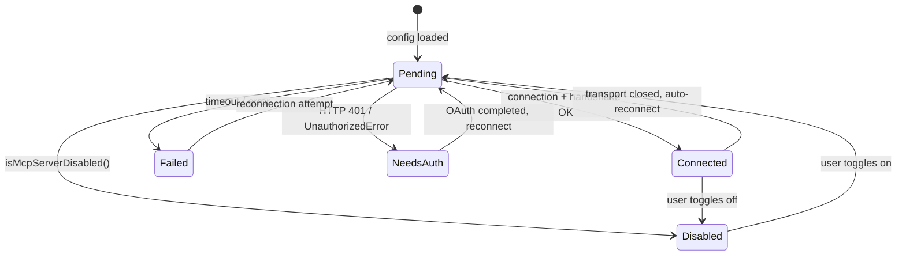
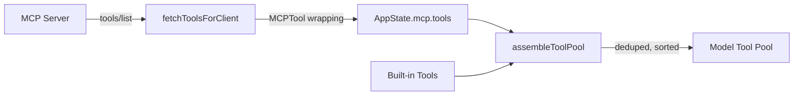
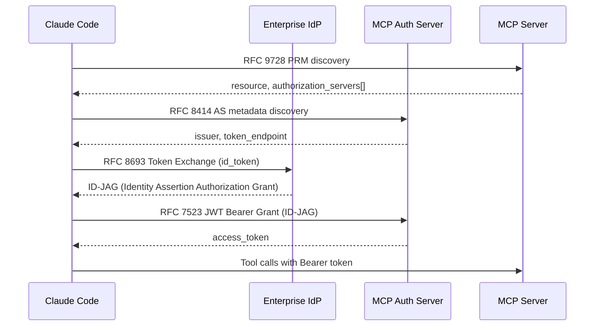

# MCP Integration

## Context

The [Model Context Protocol (MCP)](https://modelcontextprotocol.io/) is an open standard that lets LLM applications discover and invoke external tools, resources, and prompts from arbitrary servers. Claude Code acts as an MCP **client**: it connects to one or more MCP servers at startup, fetches their tool/resource/prompt catalogs, and merges them into the tool pool the model can use during a conversation.

This is the primary extensibility surface. Any capability Claude Code does not ship natively -- Jira integration, database queries, proprietary CI pipelines -- can be added by pointing it at an MCP server that exposes those operations.

---

## Key Files

All files live under `source/src/services/mcp/`.

| File | Purpose |
|------|---------|
| `types.ts` | Core type definitions: `MCPServerConnection` union, `ScopedMcpServerConfig`, transport schemas, config scopes |
| `client.ts` | Connection logic (`connectToServer`), tool/resource/command fetching, tool call execution, reconnection |
| `useManageMCPConnections.ts` | React hook that owns the full connection lifecycle, batched state updates, reconnection with exponential backoff |
| `config.ts` | Configuration loading and merging across scopes, policy filtering (allow/deny lists), add/remove config operations |
| `auth.ts` | OAuth flows (`ClaudeAuthProvider`, `performMCPOAuthFlow`), token storage, revocation, step-up detection |
| `elicitationHandler.ts` | Server-initiated elicitation (form and URL modes), hooks for programmatic response |
| `normalization.ts` | `normalizeNameForMCP()` -- sanitizes server/tool names to `[a-zA-Z0-9_-]` |
| `claudeai.ts` | Fetches org-managed MCP server configs from the Claude.ai API, dedup, memoization |
| `channelNotification.ts` | Channel push notifications (`notifications/claude/channel`), gate logic for registration |
| `channelPermissions.ts` | Permission prompt relay over channels (structured `request_id` + `behavior` events) |
| `channelAllowlist.ts` | Approved channel plugins allowlist (GrowthBook-backed) |
| `MCPConnectionManager.tsx` | React context provider that wraps `useManageMCPConnections`, exposes `reconnectMcpServer` and `toggleMcpServer` |
| `mcpStringUtils.ts` | Tool name construction (`buildMcpToolName`), prefix extraction, display name parsing |
| `vscodeSdkMcp.ts` | VS Code SDK MCP bidirectional notifications (file updates, experiment gates, log events) |
| `xaa.ts` | Cross-App Access (XAA / SEP-990): PRM discovery, token exchange, JWT bearer grant |
| `xaaIdpLogin.ts` | XAA IdP login: acquires OIDC `id_token` via authorization_code + PKCE, caches by issuer |
| `SdkControlTransport.ts` | Transport bridge for SDK in-process MCP servers (CLI process <-> SDK process via control messages) |
| `InProcessTransport.ts` | Linked transport pair for running MCP server and client in the same process |
| `headersHelper.ts` | Dynamic header injection via `headersHelper` scripts |
| `envExpansion.ts` | `${VAR}` and `${VAR:-default}` expansion in MCP server configs |
| `oauthPort.ts` | OAuth redirect port selection and `buildRedirectUri` helper |
| `officialRegistry.ts` | Fetches the official MCP server registry for URL validation |
| `utils.ts` | Shared helpers: tool filtering by server, command ownership, logging-safe URL extraction |

---

## Server Lifecycle

### MCPServerConnection Union

Every MCP server connection is represented as one of five discriminated-union states defined in `types.ts`:

```
MCPServerConnection =
  | ConnectedMCPServer   -- client handle, capabilities, cleanup fn
  | FailedMCPServer      -- config + error message
  | NeedsAuthMCPServer   -- awaiting OAuth
  | PendingMCPServer     -- connecting (includes reconnectAttempt/maxReconnectAttempts)
  | DisabledMCPServer    -- user-disabled via /mcp
```



### useManageMCPConnections

The `useManageMCPConnections` hook in `useManageMCPConnections.ts` is the top-level orchestrator. It:

1. Calls `getMcpToolsCommandsAndResources()` which loads all configs via `getAllMcpConfigs()` and connects to each server concurrently (local servers at concurrency 3, remote servers at concurrency 20).
2. Receives each connection result via `onConnectionAttempt` and batches state updates into `AppState.mcp` (flushed every 16ms via `setTimeout`).
3. Registers the real elicitation handler on connected clients (overwriting the default cancel-all handler set during `connectToServer`).
4. Sets up `client.onclose` for automatic reconnection on remote transports.

### Reconnection with Exponential Backoff

When a remote transport (SSE, HTTP, WebSocket, claude.ai proxy) closes or disconnects:

- Constants: `MAX_RECONNECT_ATTEMPTS = 5`, `INITIAL_BACKOFF_MS = 1000`, `MAX_BACKOFF_MS = 30000`
- Backoff formula: `min(1000 * 2^(attempt-1), 30000)` -- i.e., 1s, 2s, 4s, 8s, 16s (capped at 30s)
- Each attempt transitions the server to `PendingMCPServer` with `reconnectAttempt` / `maxReconnectAttempts` so the UI can display progress.
- If the server is disabled mid-reconnection, the loop aborts.
- stdio and sdk transports do **not** auto-reconnect (local processes).

Additionally, `client.ts` detects terminal connection errors (ECONNRESET, ETIMEDOUT, EPIPE, etc.) and MCP session expiry (HTTP 404 + JSON-RPC code -32001). After 3 consecutive terminal errors, it forcefully closes the transport to trigger the reconnection loop.

---

## Transport Types

The `Transport` enum in `types.ts` defines the wire-level transport schemas. The `McpServerConfig` union adds two internal-only types (`claudeai-proxy`, `ws-ide`).

| Transport | Schema Type | Config Fields | Notes |
|-----------|-------------|---------------|-------|
| `stdio` | `McpStdioServerConfigSchema` | `command`, `args`, `env` | Default when `type` is omitted. Spawns a subprocess. |
| `sse` | `McpSSEServerConfigSchema` | `url`, `headers`, `headersHelper`, `oauth` | Legacy SSE transport via `SSEClientTransport`. |
| `http` | `McpHTTPServerConfigSchema` | `url`, `headers`, `headersHelper`, `oauth` | MCP Streamable HTTP (`StreamableHTTPClientTransport`). |
| `ws` | `McpWebSocketServerConfigSchema` | `url`, `headers`, `headersHelper` | WebSocket transport via `WebSocketTransport`. |
| `sdk` | `McpSdkServerConfigSchema` | `name` | In-SDK MCP server. Uses `SdkControlClientTransport` to bridge CLI <-> SDK process. |
| `claudeai-proxy` | `McpClaudeAIProxyServerConfigSchema` | `url`, `id` | Claude.ai org-managed connectors. Routed through Anthropic's MCP proxy. |
| `sse-ide` | `McpSSEIDEServerConfigSchema` | `url`, `ideName`, `ideRunningInWindows` | Internal IDE extension transport (SSE). |
| `ws-ide` | `McpWebSocketIDEServerConfigSchema` | `url`, `ideName`, `authToken`, `ideRunningInWindows` | Internal IDE extension transport (WebSocket). |

Connection is handled in `connectToServer` (`client.ts`), which branches on `serverRef.type` and constructs the appropriate SDK transport. Special cases:

- **In-process servers**: Chrome MCP and Computer Use MCP servers use `InProcessTransport` (linked transport pair) to avoid spawning a ~325MB subprocess.
- **Session ingress**: When a session ingress JWT is present (remote CCR sessions), it is injected as a `Bearer` header on HTTP/WS transports.

---

## Tool Bridging

MCP tools from external servers are bridged into Claude Code's native `Tool` interface through a multi-step pipeline.

### fetchToolsForClient

Defined in `client.ts`, this memoized function:

1. Checks `client.capabilities.tools` -- skips servers that don't advertise tools.
2. Sends `tools/list` to the connected MCP server.
3. Sanitizes the response (Unicode normalization via `recursivelySanitizeUnicode`).
4. Wraps each MCP tool as a Claude Code `Tool` object using the `MCPTool` base, setting:
   - `name`: `mcp__<normalizedServerName>__<normalizedToolName>` (via `buildMcpToolName`)
   - `mcpInfo`: `{ serverName, toolName }` for permission checking
   - `inputJSONSchema`: passed through from the MCP tool's `inputSchema`
   - `description` / `prompt`: truncated to 2048 chars
   - Tool annotations: `readOnlyHint`, `destructiveHint`, `openWorldHint`
   - `searchHint` / `alwaysLoad` from `_meta['anthropic/searchHint']` and `_meta['anthropic/alwaysLoad']`

### Name Normalization

`normalizeNameForMCP()` in `normalization.ts` replaces any character not matching `[a-zA-Z0-9_-]` with underscores. For claude.ai servers (names starting with `"claude.ai "`), it additionally collapses consecutive underscores and strips leading/trailing underscores to prevent interference with the `__` delimiter.

Tool names follow the pattern: `mcp__<server>__<tool>` (constructed by `buildMcpToolName` in `mcpStringUtils.ts`).

### assembleToolPool Merge

`assembleToolPool()` in `tools.ts` is the final merge point:

1. Fetches built-in tools via `getTools()`.
2. Filters MCP tools through deny rules.
3. Sorts each partition (built-in, MCP) alphabetically for prompt-cache stability.
4. Deduplicates by name (`uniqBy`) -- built-ins win on conflict.

The result is the complete tool array sent to the model. `mergeAndFilterTools()` in `toolPool.ts` performs an additional merge layer for initial tools from props.



---

## Resource System

MCP servers that declare the `resources` capability expose structured data (files, database records, etc.) that the model can read without executing code.

### ListMcpResources Tool

`ListMcpResourcesTool` (in `tools/ListMcpResourcesTool/`) lets the model list available resources across all connected MCP servers. Resources are fetched via `fetchResourcesForClient` which sends `resources/list` and tags each resource with its `server` name as a `ServerResource`.

### ReadMcpResource Tool

`ReadMcpResourceTool` (in `tools/ReadMcpResourceTool/`) reads a specific resource by URI. Both tools are added to the tool pool only when at least one server declares resource support, and only once (deduplication prevents multiple copies).

Resources are stored per-server in `AppState.mcp.resources` as `Record<string, ServerResource[]>`.

---

## Authentication

### OAuth Flows

Remote MCP servers (SSE, HTTP) can require OAuth authentication. The flow is managed by `ClaudeAuthProvider` in `auth.ts`, which implements the MCP SDK's `OAuthClientProvider` interface:

1. **Discovery**: `fetchAuthServerMetadata` performs RFC 9728 (PRM) then RFC 8414 discovery to find the authorization server metadata. Supports a configured `authServerMetadataUrl` override.
2. **Dynamic Client Registration (DCR)**: The SDK handles DCR automatically. `ClaudeAuthProvider` provides `clientMetadata` with `token_endpoint_auth_method: "none"` (public client). Supports CIMD (SEP-991) via `clientMetadataUrl`.
3. **Authorization Code + PKCE**: `performMCPOAuthFlow` starts a local HTTP server on a random port, opens the browser to the authorization URL, and waits for the callback. The redirect URI uses `http://localhost:<port>/callback`.
4. **Token Storage**: Tokens and client info are persisted in secure storage (macOS Keychain) keyed by `<serverName>|<configHash>`.
5. **Token Refresh**: `ClaudeAuthProvider._doRefresh` handles refresh_token grants with retry logic for transient errors (`server_error`, `temporarily_unavailable`, `too_many_requests`). Invalid grants trigger credential invalidation.
6. **Step-up Detection**: `wrapFetchWithStepUpDetection` detects 403 responses with `insufficient_scope` and triggers re-authorization with the requested scope.

### McpAuthTool

When a server is in `needs-auth` state, `createMcpAuthTool` (`tools/McpAuthTool/McpAuthTool.ts`) generates a pseudo-tool named `mcp__<server>__authenticate`. This lets the model trigger the OAuth flow programmatically by calling the tool, which returns the authorization URL for the user to open. Once OAuth completes in the background, `reconnectMcpServerImpl` replaces the pseudo-tool with the server's real tools via prefix-based replacement.

### Elicitation Handler

MCP servers can send elicitation requests (form-based or URL-based) to gather information from the user. `registerElicitationHandler` in `elicitationHandler.ts`:

1. Registers a handler for `ElicitRequestSchema` on the client.
2. First runs elicitation hooks (`runElicitationHooks`) which can provide programmatic responses.
3. If no hook responds, queues the elicitation event in `AppState.elicitation.queue` for the UI to render.
4. For URL elicitations, listens for `ElicitationCompleteNotification` from the server to mark completion.
5. After the user responds, runs `runElicitationResultHooks` which can modify or block the response.

---

## Channel Permissions

The channel system (gated by feature flags `KAIROS` / `KAIROS_CHANNELS`) lets MCP servers push user messages into the conversation via `notifications/claude/channel`. This is how messaging integrations (Discord, Slack, Telegram, iMessage) inject inbound messages.

### Per-Server Gating

`gateChannelServer()` in `channelNotification.ts` runs a multi-layered gate to decide whether a connected server's channel notification handler should be registered:

1. **Capability**: Server must declare `experimental['claude/channel']` in its capabilities.
2. **Runtime gate**: `isChannelsEnabled()` checks the `tengu_harbor` GrowthBook flag.
3. **Auth**: Requires claude.ai OAuth tokens (API-key-only users are blocked).
4. **Org policy**: Teams/Enterprise orgs must set `channelsEnabled: true` in managed settings.
5. **Session**: Server must be listed in the session's `--channels` argument.
6. **Marketplace verification** (plugin-kind): Verifies the installed plugin's marketplace matches the `--channels` tag.
7. **Allowlist**: Plugin must be on the approved channels allowlist (`tengu_harbor_ledger`).

### Permission Relay

When the `claude/channel/permission` capability is declared, the server can participate in permission prompt relay (`channelPermissions.ts`). Instead of text-based matching, the server parses the user's reply (e.g., "yes tbxkq") and emits a structured `notifications/claude/channel/permission` event with `{ request_id, behavior }`. This is matched against a pending request map. Permission IDs are 5-letter codes from a 25-character alphabet (a-z minus 'l') generated by `shortRequestId()`.

---

## Claude AI MCP Servers

Claude.ai organizations can configure MCP servers (connectors) in the web UI. `claudeai.ts` handles fetching and integrating these:

1. **`fetchClaudeAIMcpConfigsIfEligible`**: Memoized (once per session). Checks for OAuth token with `user:mcp_servers` scope, then fetches from `GET /v1/mcp_servers?limit=1000` with the `mcp-servers-2025-12-04` beta header. Each server becomes a `claudeai-proxy` config with scope `claudeai`.
2. **Naming**: Servers are named `claude.ai <display_name>` with collision handling (appends `(2)`, `(3)`, etc.).
3. **Deduplication**: `dedupClaudeAiMcpServers` in `config.ts` drops claude.ai connectors whose URL signature matches an enabled manually-configured server. Manual always wins.
4. **Proxy transport**: claude.ai connectors use `StreamableHTTPClientTransport` pointed at Anthropic's MCP proxy URL (`MCP_PROXY_URL` + server ID path). `createClaudeAiProxyFetch` wraps fetch to inject OAuth bearer tokens and retry once on 401.
5. **Ever-connected tracking**: `markClaudeAiMcpConnected` persists successfully-connected server names in global config to gate startup notifications (only warn about servers that previously worked).

---

## XAA Integration

Cross-App Access (XAA / SEP-990) provides browser-free MCP server authentication for enterprise environments by chaining two OAuth grant types. Implemented in `xaa.ts` and `xaaIdpLogin.ts`.

### Flow



### Key Design Points

- **One browser pop**: The user authenticates once at their IdP; the `id_token` is cached in the keychain by issuer. Subsequent XAA-enabled servers reuse it silently.
- **Configuration**: `oauth.xaa: true` on the server config enables XAA. IdP connection details (`issuer`, `clientId`, `callbackPort`) come from `settings.xaaIdp` -- configured once, shared across all XAA-enabled servers.
- **No fallback**: If `oauth.xaa` is set but `CLAUDE_CODE_ENABLE_XAA` is not truthy, the flow hard-fails rather than silently degrading to consent.
- **`XaaTokenExchangeError`**: Carries `shouldClearIdToken` to distinguish 4xx (bad token, clear cache) from 5xx (IdP down, keep cache).
- **Auth method selection**: `performCrossAppAccess` reads `token_endpoint_auth_methods_supported` from AS metadata and selects `client_secret_basic` (default, SEP-990 conformance) or `client_secret_post` as needed.

---

## VS Code SDK

`vscodeSdkMcp.ts` sets up the special `claude-vscode` SDK MCP server for bidirectional communication between Claude Code and the VS Code extension:

- **`setupVscodeSdkMcp`**: Finds the `claude-vscode` client among SDK connections and:
  - Stores a module-level reference for outbound notifications.
  - Registers a `log_event` notification handler that forwards events to analytics as `tengu_vscode_<eventName>`.
  - Sends an `experiment_gates` notification with current feature flag values (review upsell, onboarding, browser support, CC auth, auto-mode state).
- **`notifyVscodeFileUpdated`**: Sends `file_updated` notifications when Claude edits or writes files, so VS Code can refresh its view.

---

## Configuration

### ScopedMcpServerConfig

Every server config in the system carries a `scope` field indicating its origin:

```typescript
type ScopedMcpServerConfig = McpServerConfig & {
  scope: ConfigScope
  pluginSource?: string  // e.g., 'slack@anthropic'
}
```

### Config Scopes

The `ConfigScope` enum defines where a server config was loaded from:

| Scope | Source | Precedence |
|-------|--------|------------|
| `enterprise` | `managed-mcp.json` (via managed settings path) | Exclusive -- when present, **all other scopes are ignored** |
| `managed` | Policy settings | Used for allow/deny list enforcement |
| `claudeai` | Claude.ai API (`/v1/mcp_servers`) | Lowest -- deduped against manual configs |
| `user` | Global config (`~/.claude.json` `mcpServers`) | Medium |
| `project` | `.mcp.json` in project root | Medium (requires user approval) |
| `local` | Project-local settings (`.claude/settings.local.json` `mcpServers`) | Highest among non-enterprise |
| `dynamic` | `--mcp-config` CLI flag or SDK `setMcpServers()` | Runtime-only |

### Config Merge Order

`getClaudeCodeMcpConfigs()` in `config.ts` merges configs with this precedence (later wins):

```
plugin < user < project (approved only) < local
```

Enterprise mode short-circuits: if `managed-mcp.json` exists, only enterprise configs are returned.

### Policy Filtering

After merging, `isMcpServerAllowedByPolicy` checks each server against:

- **Denylist** (`deniedMcpServers`): Blocks by name, command array, or URL pattern. Always checked from all settings sources.
- **Allowlist** (`allowedMcpServers`): When present, only listed servers are allowed. Supports name, command, and URL-with-wildcards matching.

`filterMcpServersByPolicy` applies these checks and exempts `sdk`-type servers (they are SDK-managed transport placeholders, not CLI-managed connections).

### Environment Variable Expansion

`expandEnvVarsInString()` in `envExpansion.ts` supports `${VAR}` and `${VAR:-default}` syntax in server config fields (command, args, env values, URLs, headers). Missing variables are tracked and reported as warnings.
