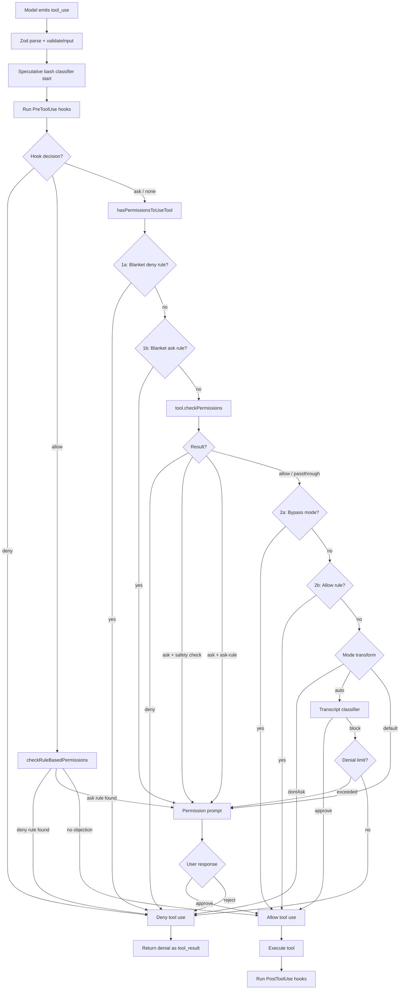

# Permissions & Security

> **Context**: Every tool call in Claude Code passes through a multi-layered permission system before it executes. The system is designed to fail closed — if any layer objects, the tool does not run. This page explains the permission modes, the rule engine, the classifier, hooks, and the trust model that tie them together.

---

## Key Files

| File | Purpose |
|------|---------|
| [`source/src/Tool.ts`](../../source/src/Tool.ts) | `ToolPermissionContext` type, `getEmptyToolPermissionContext()`, `checkPermissions()` on every `Tool` |
| [`source/src/tools.ts`](../../source/src/tools.ts) | `filterToolsByDenyRules()` — strips blanket-denied tools before the model sees them |
| [`source/src/types/permissions.ts`](../../source/src/types/permissions.ts) | Canonical type definitions: `PermissionMode`, `PermissionDecision`, `PermissionRule`, `PermissionResult` |
| [`source/src/utils/permissions/permissions.ts`](../../source/src/utils/permissions/permissions.ts) | `hasPermissionsToUseTool()`, `checkRuleBasedPermissions()`, rule matching, auto-mode classifier dispatch |
| [`source/src/utils/permissions/PermissionMode.ts`](../../source/src/utils/permissions/PermissionMode.ts) | Mode metadata: titles, symbols, color keys, conversion helpers |
| [`source/src/utils/permissions/PermissionRule.ts`](../../source/src/utils/permissions/PermissionRule.ts) | `PermissionRule`, `PermissionRuleValue`, `PermissionBehavior` types |
| [`source/src/utils/permissions/denialTracking.ts`](../../source/src/utils/permissions/denialTracking.ts) | Consecutive/total denial counters for auto-mode fallback |
| [`source/src/utils/permissions/yoloClassifier.ts`](../../source/src/utils/permissions/yoloClassifier.ts) | Auto-mode transcript classifier (side-query to Claude) |
| [`source/src/utils/permissions/bashClassifier.ts`](../../source/src/utils/permissions/bashClassifier.ts) | Bash-specific allow classifier (per-command, `BASH_CLASSIFIER` flag) |
| [`source/src/utils/permissions/classifierDecision.ts`](../../source/src/utils/permissions/classifierDecision.ts) | Safe-tool allowlist for auto mode (`isAutoModeAllowlistedTool`) |
| [`source/src/utils/permissions/permissionsLoader.ts`](../../source/src/utils/permissions/permissionsLoader.ts) | Loads permission rules from all settings sources on disk |
| [`source/src/utils/permissions/permissionSetup.ts`](../../source/src/utils/permissions/permissionSetup.ts) | Startup initialization, mode transitions, dangerous-rule stripping |
| [`source/src/utils/permissions/getNextPermissionMode.ts`](../../source/src/utils/permissions/getNextPermissionMode.ts) | Shift+Tab mode cycling logic |
| [`source/src/services/tools/toolExecution.ts`](../../source/src/services/tools/toolExecution.ts) | `runToolUse()` / `checkPermissionsAndCallTool()` — orchestrates the full permission check per tool call |
| [`source/src/services/tools/toolHooks.ts`](../../source/src/services/tools/toolHooks.ts) | `resolveHookPermissionDecision()`, `runPreToolUseHooks()`, `runPostToolUseHooks()` |
| [`source/src/hooks/toolPermission/PermissionContext.ts`](../../source/src/hooks/toolPermission/PermissionContext.ts) | `createPermissionContext()` — builds the per-tool-call permission context object |
| [`source/src/hooks/toolPermission/handlers/interactiveHandler.ts`](../../source/src/hooks/toolPermission/handlers/interactiveHandler.ts) | Interactive (REPL) permission dialog: queues, classifier race, user callbacks |
| [`source/src/hooks/useCanUseTool.tsx`](../../source/src/hooks/useCanUseTool.tsx) | React hook that wires `hasPermissionsToUseTool` into the REPL UI |
| [`source/src/components/TrustDialog/TrustDialog.tsx`](../../source/src/components/TrustDialog/TrustDialog.tsx) | First-launch trust prompt for project-level settings |

---

## Permission Modes

The active mode is stored in `ToolPermissionContext.mode`. Users cycle through modes with **Shift+Tab** (see `getNextPermissionMode()`), and the mode can also be set via `--permission-mode` CLI flag or `settings.json`.

| Mode | Internal Name | Behavior |
|------|---------------|----------|
| **Default** | `default` | Every non-read-only tool call prompts the user for approval unless covered by an allow rule. This is the startup mode. |
| **Accept Edits** | `acceptEdits` | File edits and writes inside the working directory are auto-approved. Bash and other side-effecting tools still prompt. |
| **Plan** | `plan` | The model is restricted to read-only tools. Write tools return an `ask` decision. If the user originally started in `bypassPermissions`, bypass remains available during plan mode (`isBypassPermissionsModeAvailable`). A `prePlanMode` field stores the mode to restore on exit. |
| **Bypass Permissions** | `bypassPermissions` | All tool calls are auto-approved except those blocked by deny rules (step 1a), content-specific ask rules (step 1f), or safety checks (step 1g for `.git/`, `.claude/`, shell configs, etc.). Requires explicit opt-in. |
| **Don't Ask** | `dontAsk` | Like auto, but without a classifier: any `ask` result is silently converted to `deny`. The model retries with alternative approaches. Used in non-interactive pipelines where prompting is impossible. |
| **Auto** | `auto` | Gated by the `TRANSCRIPT_CLASSIFIER` feature flag. An AI classifier (side-query) evaluates each `ask` decision. If the classifier approves, the tool runs; if it blocks, the tool is denied with a reason. Falls back to user prompting after denial limits are hit. Internal only (ant-only). |
| **Bubble** | `bubble` | Internal mode for coordinator workers that bubble permission requests up to the parent. Not user-addressable. |

The external-facing modes (visible in the SDK/API) are `default`, `acceptEdits`, `bypassPermissions`, `dontAsk`, and `plan`. `auto` and `bubble` are internal-only and excluded from `ExternalPermissionMode`.

---

## ToolPermissionContext

Every permission check reads from `ToolPermissionContext`, which lives in `AppState.toolPermissionContext`. The type (defined in `Tool.ts`, re-exported from `types/permissions.ts`) is `DeepImmutable`:

```typescript
type ToolPermissionContext = DeepImmutable<{
  mode: PermissionMode
  additionalWorkingDirectories: Map<string, AdditionalWorkingDirectory>
  alwaysAllowRules: ToolPermissionRulesBySource   // e.g. { session: ["Bash(git *)"], userSettings: ["FileRead"] }
  alwaysDenyRules: ToolPermissionRulesBySource
  alwaysAskRules: ToolPermissionRulesBySource
  isBypassPermissionsModeAvailable: boolean
  isAutoModeAvailable?: boolean
  strippedDangerousRules?: ToolPermissionRulesBySource
  shouldAvoidPermissionPrompts?: boolean           // true for headless/background agents
  awaitAutomatedChecksBeforeDialog?: boolean        // true for coordinator workers
  prePlanMode?: PermissionMode                     // mode to restore after exiting plan
}>
```

`getEmptyToolPermissionContext()` returns a minimal default: `mode: 'default'`, empty rule maps, `isBypassPermissionsModeAvailable: false`.

**`ToolPermissionRulesBySource`** maps each `PermissionRuleSource` to an array of rule strings. Sources, in precedence order during loading:

| Source | Origin |
|--------|--------|
| `policySettings` | Enterprise/managed policy (`~/.claude/managed_settings.json`) |
| `flagSettings` | Feature flags |
| `userSettings` | `~/.claude/settings.json` |
| `localSettings` | `.claude/settings.local.json` in the project |
| `projectSettings` | `.claude/settings.json` in the project |
| `cliArg` | `--allowedTools` / `--disallowedTools` flags |
| `command` | Slash commands that modify permissions |
| `session` | Runtime grants from the user during the current session |

---

## Resolution Flow

When the model emits a `tool_use` block, `runToolUse()` in `toolExecution.ts` orchestrates the full permission pipeline. The core logic lives in `checkPermissionsAndCallTool()`:

### Step-by-step

1. **Input validation** — Zod parse, then `tool.validateInput()`.
2. **Speculative classifier start** — For Bash, `startSpeculativeClassifierCheck()` kicks off the allow classifier in the background so it runs in parallel with hooks.
3. **PreToolUse hooks** — `runPreToolUseHooks()` runs all configured `PreToolUse` hooks. A hook can return `allow`, `deny`, `ask`, or just modify the input.
4. **Hook permission resolution** — `resolveHookPermissionDecision()` merges the hook result with rule-based checks:
   - Hook `allow` does **not** bypass deny/ask rules — `checkRuleBasedPermissions()` still applies.
   - Hook `deny` is final.
   - Hook `ask` or no decision falls through to the normal permission flow.
5. **`hasPermissionsToUseTool()`** — The main permission function, called via `canUseTool`:
   - **1a.** Blanket deny rule check (`getDenyRuleForTool`)
   - **1b.** Blanket ask rule check (`getAskRuleForTool`)
   - **1c.** Tool-specific `checkPermissions()` (e.g., Bash subcommand matching)
   - **1d.** Tool-level deny
   - **1e.** `requiresUserInteraction` tools always prompt
   - **1f.** Content-specific ask rules (e.g., `Bash(npm publish:*)`) — respected even in bypass
   - **1g.** Safety checks (`.git/`, `.claude/`, `.vscode/`, shell configs) — bypass-immune
   - **2a.** Mode check — `bypassPermissions` auto-allows everything not caught above
   - **2b.** Whole-tool allow rule check (`toolAlwaysAllowedRule`)
   - **3.** Remaining `passthrough` results become `ask`
6. **Post-decision transforms** — `dontAsk` converts `ask` to `deny`; `auto` dispatches to the transcript classifier.
7. **Interactive dialog** — If the result is still `ask`, the UI shows a permission prompt (handled by `interactiveHandler.ts`).
8. **Tool execution** — On `allow`, the tool runs. On `deny`, the model gets the denial message as a tool result.
9. **PostToolUse hooks** — `runPostToolUseHooks()` runs after the tool completes.

### Flowchart



---

## Deny Rules

`filterToolsByDenyRules()` in `tools.ts` runs at tool-pool assembly time (before the model ever sees the tool list). It removes any tool that has a **blanket deny rule** — a deny rule with no `ruleContent` (i.e., the entire tool is denied, not just specific subcommands).

```typescript
export function filterToolsByDenyRules<T extends { name: string; mcpInfo?: ... }>(
  tools: readonly T[],
  permissionContext: ToolPermissionContext,
): T[] {
  return tools.filter(tool => !getDenyRuleForTool(permissionContext, tool))
}
```

This delegates to `getDenyRuleForTool()`, which iterates all deny rules from every source and checks `toolMatchesRule()`. The matcher handles:

- **Direct name match**: rule `"Bash"` matches the Bash tool.
- **MCP server-level match**: rule `"mcp__server1"` matches all tools from that server (`mcp__server1__tool1`, `mcp__server1__tool2`, etc.).
- **MCP wildcard**: rule `"mcp__server1__*"` also matches all tools from that server.

Content-specific deny rules (e.g., `Bash(rm -rf:*)`) are **not** blanket denies — they have `ruleContent` and are evaluated at runtime by `tool.checkPermissions()`, not at assembly time.

---

## Denial Tracking

`denialTracking.ts` tracks classifier denials to prevent infinite deny loops in auto mode:

```typescript
type DenialTrackingState = {
  consecutiveDenials: number
  totalDenials: number
}

const DENIAL_LIMITS = {
  maxConsecutive: 3,
  maxTotal: 20,
}
```

- `recordDenial()` increments both counters.
- `recordSuccess()` resets `consecutiveDenials` to 0 (total is not reset).
- `shouldFallbackToPrompting()` returns `true` when either limit is hit.

When the auto-mode classifier blocks a tool and the limit is exceeded:
- **Interactive sessions**: the system falls back to the normal permission prompt so the user can review.
- **Headless sessions** (`shouldAvoidPermissionPrompts`): an `AbortError` is thrown, terminating the agent.

The state lives in `AppState.denialTracking`. For async subagents (whose `setAppState` is a no-op), a mutable `localDenialTracking` object on `ToolUseContext` is used instead, updated via `Object.assign`.

---

## Trust Dialog

`TrustDialog` (`source/src/components/TrustDialog/TrustDialog.tsx`) is the first-launch security gate shown when Claude Code is run in a project directory for the first time. It displays:

- **MCP servers** configured at the project level
- **Hooks** from project settings
- **Bash execution** permissions (project settings, slash commands, skills)
- **API key helpers**, **AWS commands**, **GCP commands** from settings
- **Dangerous environment variables** detected in the project config
- **OTel headers helpers** if configured

The user must explicitly accept (`onChange` handler) to proceed. The acceptance is persisted:
- For the home directory: `setSessionTrustAccepted(true)` — session-scoped only.
- For project directories: `saveCurrentProjectConfig()` — persisted to `.claude/` so re-launches in the same project skip the dialog.

If the user selects "exit" instead, `gracefulShutdownSync(1)` terminates the process.

---

## Bash Safety Classifier

The `BASH_CLASSIFIER` feature flag gates a per-command bash classifier that can auto-approve commands while the user is looking at the permission dialog.

### How it works

1. When a Bash tool call enters `checkPermissionsAndCallTool()`, `startSpeculativeClassifierCheck()` is called **before** hooks and permission checks. This runs the classifier in the background.
2. If the main permission flow returns `ask` with a `pendingClassifierCheck`, the interactive handler races the classifier result against user input.
3. `awaitClassifierAutoApproval()` resolves the pending check. If the classifier approves, it resolves the permission dialog automatically (before the user clicks anything).
4. The classifier uses `classifyBashCommand()` from `bashClassifier.ts`, which sends the command + descriptions to an LLM and parses the result.

In external (non-Anthropic) builds, `bashClassifier.ts` is a stub that always returns `{ matches: false }` — the feature is effectively disabled.

The `TRANSCRIPT_CLASSIFIER` flag controls the broader auto-mode classifier (`yoloClassifier.ts`), which evaluates the full conversation transcript rather than individual bash commands.

---

## Hook-Based Permissions

Hooks are configured in `settings.json` under the `hooks` key. Three hook events participate in the permission lifecycle:

### PreToolUse

Runs **before** the permission check. `runPreToolUseHooks()` in `toolHooks.ts` processes each hook result:

- **`permissionBehavior: 'allow'`** — Hook approves the tool. But this does NOT skip rule-based checks. `resolveHookPermissionDecision()` still calls `checkRuleBasedPermissions()`:
  - If a deny rule matches, the deny wins.
  - If an ask rule matches, the user is still prompted.
  - Only if no rule objects does the hook approval take effect.
- **`permissionBehavior: 'deny'`** — Hook denies the tool. This is final.
- **`permissionBehavior: 'ask'`** — Hook forces a user prompt, with an optional message.
- **`blockingError`** — Hook exits with an error, treated as a deny.
- **`updatedInput`** — Hook can modify the tool input (without making a permission decision), and the modified input flows into the normal permission check.
- **`preventContinuation`** — Stops the entire query loop, not just this tool.

### PermissionRequest

Runs **during** the permission prompt (when the result is `ask`). `executePermissionRequestHooks()` is called from `PermissionContext.runHooks()`:

- Can return `allow` (with optional `updatedPermissions` to persist) or `deny` (with optional `interrupt` to abort the session).
- Races against user input in the interactive handler.

### PostToolUse / PostToolUseFailure

Runs **after** tool execution (or failure). Can:
- Add context messages
- Block continuation (`preventContinuation`)
- Modify MCP tool output (`updatedMCPToolOutput`)
- Report errors

---

## Session vs. Persistent Permissions

Permission rules come from multiple sources with different lifetimes:

### Persistent (survive restarts)

| Source | Location | Scope |
|--------|----------|-------|
| `userSettings` | `~/.claude/settings.json` | Global — applies to all projects |
| `projectSettings` | `.claude/settings.json` | Project — shared with the team via version control |
| `localSettings` | `.claude/settings.local.json` | Project-local — gitignored, personal overrides |
| `policySettings` | `~/.claude/managed_settings.json` | Enterprise — managed by IT/policy tooling |
| `flagSettings` | Feature flags | Server-controlled |

### Session-scoped (reset on restart)

| Source | Lifetime |
|--------|----------|
| `session` | Current Claude Code session only |
| `cliArg` | Current invocation only (from `--allowedTools`, `--disallowedTools`) |
| `command` | Current session (set by slash commands) |

When a user approves a tool in the permission dialog, they can choose:
- **"Allow once"** — creates a `session`-scoped allow rule (gone after restart).
- **"Always allow"** — creates a `localSettings` or `userSettings` rule (persisted to disk via `persistPermissionUpdates()`).

The mode itself (`default`, `acceptEdits`, etc.) is session-scoped unless set via `settings.json` `defaultMode`. Denial tracking state is always session-scoped.

Trust dialog acceptance is persisted per-project (to `.claude/`) except in the home directory where it is session-only.

### What resets between sessions

- The current permission mode (returns to `settings.json` `defaultMode` or `default`)
- All `session`-scoped allow/deny/ask rules
- All `cliArg` rules (unless the same flags are passed again)
- Denial tracking counters (`consecutiveDenials`, `totalDenials`)
- Classifier approval state
- Trust dialog acceptance when running from `~`
