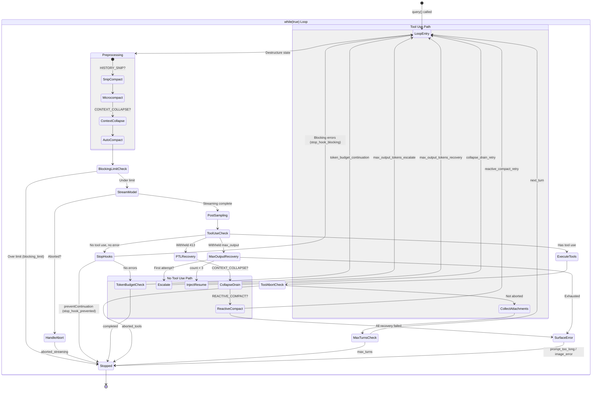

# Query Engine

> The query engine is the heart of Claude Code. It owns the conversation lifecycle: accepting a user prompt, assembling system context, calling the model in a loop, executing tools, managing compaction, and deciding when the turn is done. Every other subsystem (tools, permissions, compaction, hooks) plugs into the query engine rather than the other way around. For the full system picture, see the [Architecture Overview](architecture-overview.md).

## Key Files

| File | Purpose |
|------|---------|
| `source/src/QueryEngine.ts` | `QueryEngine` class -- session-scoped owner of messages, abort controller, usage tracking. Exposes `submitMessage()` async generator for SDK/headless callers. |
| `source/src/query.ts` | `query()` / `queryLoop()` -- the `while(true)` main loop that drives model calls, tool execution, compaction, stop hooks, and all continue/return sites. |
| `source/src/context.ts` | `getGitStatus()`, `getUserContext()`, `getSystemContext()` -- memoized system prompt assembly. |
| `source/src/query/config.ts` | `QueryConfig` / `buildQueryConfig()` -- immutable env/statsig snapshot taken once per query entry. |
| `source/src/query/deps.ts` | `QueryDeps` / `productionDeps()` -- injectable I/O dependencies (callModel, microcompact, autocompact, uuid). |
| `source/src/query/stopHooks.ts` | `handleStopHooks()` -- async generator that runs Stop, TeammateIdle, and TaskCompleted hooks after each model response. Also fires prompt suggestion, memory extraction, and auto-dream as fire-and-forget side effects. |
| `source/src/query/tokenBudget.ts` | `BudgetTracker` / `checkTokenBudget()` -- token-budget auto-continue with diminishing-returns detection. |
| `source/src/services/compact/autoCompact.ts` | `autoCompactIfNeeded()`, `shouldAutoCompact()`, `getAutoCompactThreshold()`, `calculateTokenWarningState()` -- proactive compaction trigger logic and threshold math. |
| `source/src/services/compact/compact.ts` | `compactConversation()`, `buildPostCompactMessages()`, `truncateHeadForPTLRetry()` -- the actual compaction implementation that summarizes older messages. |

## QueryEngine State Machine

`QueryEngine` is a class instantiated once per conversation. It is the entry point for SDK and headless callers; the REPL uses a parallel path (`ask()`) that shares the same `query()` loop.

### QueryEngineConfig Fields

The constructor accepts a `QueryEngineConfig` with the following fields:

| Field | Type | Purpose |
|-------|------|---------|
| `cwd` | `string` | Working directory for the session |
| `tools` | `Tools` | Available tool definitions |
| `commands` | `Command[]` | Registered slash commands |
| `mcpClients` | `MCPServerConnection[]` | Connected MCP servers |
| `agents` | `AgentDefinition[]` | Available agent definitions |
| `canUseTool` | `CanUseToolFn` | Permission-checking callback |
| `getAppState` / `setAppState` | Functions | Read/write access to global `AppState` |
| `initialMessages` | `Message[]?` | Pre-existing conversation (for resume) |
| `readFileCache` | `FileStateCache` | Shared file-content cache |
| `customSystemPrompt` | `string?` | Override the default system prompt |
| `appendSystemPrompt` | `string?` | Append to the system prompt |
| `userSpecifiedModel` | `string?` | Override model selection |
| `fallbackModel` | `string?` | Model to try on `FallbackTriggeredError` |
| `thinkingConfig` | `ThinkingConfig?` | Extended thinking configuration |
| `maxTurns` | `number?` | Hard limit on agentic turns |
| `maxBudgetUsd` | `number?` | Spend cap |
| `taskBudget` | `{ total: number }?` | API-level task budget |
| `jsonSchema` | `Record<string, unknown>?` | Schema for structured output enforcement |
| `verbose` | `boolean?` | Verbose logging |
| `replayUserMessages` | `boolean?` | Replay user messages back to SDK callers |
| `handleElicitation` | Function? | Handler for MCP elicitation errors |
| `includePartialMessages` | `boolean?` | Include partial streaming messages |
| `setSDKStatus` | Function? | SDK status callback |
| `abortController` | `AbortController?` | External abort signal |
| `orphanedPermission` | `OrphanedPermission?` | Permission from a prior aborted turn |
| `snipReplay` | Function? | Injected snip-boundary handler (HISTORY_SNIP gate) |

### Instance Variables

| Variable | Type | Purpose |
|----------|------|---------|
| `mutableMessages` | `Message[]` | The live conversation history; mutated across turns |
| `abortController` | `AbortController` | Per-session abort signal |
| `permissionDenials` | `SDKPermissionDenial[]` | Tracks tool permission denials for SDK reporting |
| `totalUsage` | `NonNullableUsage` | Cumulative token usage across all turns |
| `discoveredSkillNames` | `Set<string>` | Turn-scoped skill discovery tracking; cleared at each `submitMessage()` |
| `loadedNestedMemoryPaths` | `Set<string>` | Tracks which nested memory files have been loaded |
| `readFileState` | `FileStateCache` | Shared read-file cache persisted across turns |

### submitMessage()

```typescript
async *submitMessage(
  prompt: string | ContentBlockParam[],
  options?: { uuid?: string; isMeta?: boolean },
): AsyncGenerator<SDKMessage, void, unknown>
```

This is the primary API surface. Each call:

1. Clears `discoveredSkillNames`, sets cwd
2. Wraps `canUseTool` to track permission denials
3. Fetches system prompt parts (`fetchSystemPromptParts`)
4. Processes user input through `processUserInput` (handles slash commands)
5. Persists the user message to the transcript
6. Delegates to `query()` and yields all stream events as `SDKMessage`
7. Accumulates usage into `totalUsage`
8. Yields a final `result` message with cost, usage, and stop reason

## The Main Query Loop

The core logic lives in `queryLoop()` inside `query.ts`. It is an async generator with a `while(true)` loop whose iterations represent model call + tool execution cycles.

### State Type

Mutable state is bundled into a single `State` struct that is reassigned at each continue site:

```typescript
type State = {
  messages: Message[]
  toolUseContext: ToolUseContext
  autoCompactTracking: AutoCompactTrackingState | undefined
  maxOutputTokensRecoveryCount: number
  hasAttemptedReactiveCompact: boolean
  maxOutputTokensOverride: number | undefined
  pendingToolUseSummary: Promise<ToolUseSummaryMessage | null> | undefined
  stopHookActive: boolean | undefined
  turnCount: number
  transition: Continue | undefined
}
```

The `transition` field records **why** the previous iteration continued (e.g., `'next_turn'`, `'reactive_compact_retry'`, `'max_output_tokens_recovery'`). This is `undefined` on the first iteration.

### Loop-Local State (Outside State)

| Variable | Purpose |
|----------|---------|
| `budgetTracker` | Token budget auto-continue tracker (behind `TOKEN_BUDGET` feature gate) |
| `taskBudgetRemaining` | Tracks remaining API task budget across compaction boundaries |
| `config` | Immutable `QueryConfig` snapshot (session ID, statsig gates) |
| `pendingMemoryPrefetch` | One-shot memory prefetch; consumed when settled |

### Iteration Structure

Each iteration of the `while(true)` loop:

1. **Destructure state** -- `toolUseContext` is mutable within the iteration; the rest are read-only
2. **Start skill discovery prefetch** (if EXPERIMENTAL_SKILL_SEARCH gate)
3. **Initialize query chain tracking** -- `queryTracking.depth` increments each iteration
4. **Enforce tool result budgets** -- `applyToolResultBudget()`
5. **Apply snip compaction** (if HISTORY_SNIP gate) -- frees tokens from old messages
6. **Apply microcompact** -- cached msgId-based truncation
7. **Apply context collapse projection** (if CONTEXT_COLLAPSE gate)
8. **Run autocompact** -- proactive compaction if token count exceeds threshold
9. **Check blocking limit** -- synthetic PTL error if over hard limit (when autocompact is off)
10. **Stream model response** -- `deps.callModel()` with fallback retry
11. **Execute post-sampling hooks** -- fire-and-forget
12. **Handle abort** -- if aborted during streaming, yield interruption and return
13. **Handle recovery** -- PTL (collapse drain, reactive compact), max_output_tokens (escalate, then multi-turn), media errors
14. **Run stop hooks** -- `handleStopHooks()` for completed responses (no tool use)
15. **Check token budget** -- auto-continue if under budget threshold
16. **Execute tools** -- `runTools()` or `StreamingToolExecutor`
17. **Handle abort** -- if aborted during tool execution
18. **Collect attachments** -- file changes, memory, skill discovery, queued commands
19. **Check max_turns** -- hard turn limit
20. **Continue** -- advance to next iteration with updated messages

### Continue Sites

Each `continue` reassigns `state` with a new `State` object. The `transition.reason` values are:

| Reason | Trigger |
|--------|---------|
| `'next_turn'` | Normal tool-use follow-up; the standard path |
| `'collapse_drain_retry'` | Context collapse drained staged collapses after a PTL 413 |
| `'reactive_compact_retry'` | Reactive compact succeeded after a PTL 413 or media error |
| `'max_output_tokens_escalate'` | Retrying with `ESCALATED_MAX_TOKENS` (64K) after hitting the 8K default cap |
| `'max_output_tokens_recovery'` | Multi-turn recovery: injecting a "resume" meta-message after hitting output limit |
| `'stop_hook_blocking'` | Stop hook returned a blocking error; re-running the model with the error message |
| `'token_budget_continuation'` | Token budget not yet exhausted; nudge message injected |

## Turn Mechanics

A **turn** in the query engine corresponds to one model call plus its tool execution phase. The `turnCount` field starts at 1 and increments each time tool results are collected and the loop is about to recurse for a normal follow-up (`transition.reason === 'next_turn'`).

Recovery loops (reactive compact retry, max_output_tokens escalation/recovery, collapse drain retry, stop hook blocking) do **not** increment `turnCount` -- they retry the same logical turn.

The `autoCompactTracking.turnCounter` is separate: it counts turns since the last compaction and resets to 0 on each successful compact.

### Token Budget Carryover

When the `TOKEN_BUDGET` feature is enabled, a `BudgetTracker` tracks cumulative output tokens across the turn. After each completed response (no tool use), `checkTokenBudget()` decides whether to continue:

- **Continue** if `turnTokens < budget * 0.9` (COMPLETION_THRESHOLD) and not diminishing returns
- **Stop** if tokens are near the budget or `deltaSinceLastCheck < 500` for 3+ consecutive checks (diminishing returns)

The nudge message injected on continuation uses `getBudgetContinuationMessage()` to tell the model its progress percentage.

## Stop Conditions

The `queryLoop()` generator returns a `Terminal` object with a `reason` field. The possible stop reasons are:

| Reason | Trigger |
|--------|---------|
| `'completed'` | Model response with no tool use; normal end of turn |
| `'max_turns'` | `nextTurnCount > maxTurns` after tool execution |
| `'stop_hook_prevented'` | A stop hook set `preventContinuation: true` |
| `'hook_stopped'` | A tool-execution hook indicated to prevent continuation |
| `'aborted_streaming'` | `abortController.signal` fired during model streaming |
| `'aborted_tools'` | `abortController.signal` fired during tool execution |
| `'blocking_limit'` | Token count exceeds the hard blocking limit (autocompact disabled) |
| `'prompt_too_long'` | API returned 413 and all recovery strategies exhausted |
| `'image_error'` | `ImageSizeError` or `ImageResizeError`, or unrecoverable media error |
| `'model_error'` | Unexpected error thrown by `queryModelWithStreaming` |

## Compaction Strategies

The query engine has multiple compaction strategies that activate at different thresholds and conditions. They are applied in this order within each loop iteration.

### 1. Snip Compact (HISTORY_SNIP feature gate)

Applied first, before microcompact. `snipModule.snipCompactIfNeeded()` removes old message segments from the conversation, yielding a boundary message. The `snipTokensFreed` value is tracked and passed to autocompact so its threshold check accounts for what snip already removed (since `tokenCountWithEstimation` reads usage from the surviving tail assistant message, which still reflects pre-snip context size).

### 2. Microcompact (CACHED_MICROCOMPACT feature gate for cache editing path)

Applied after snip. `deps.microcompact()` (backed by `microcompactMessages()`) performs cached msgId-based truncation of tool results. The non-cached path runs unconditionally; the cached path (using `cache_deleted_input_tokens`) is gated behind `CACHED_MICROCOMPACT`. When cache editing is used, the boundary message is deferred until after the API response so it can report actual `cache_deleted_input_tokens` from the API usage.

### 3. Context Collapse (CONTEXT_COLLAPSE feature gate)

Applied after microcompact but before autocompact. `contextCollapse.applyCollapsesIfNeeded()` projects a collapsed context view over the REPL's full history. Summary messages live in the collapse store, not the REPL array. This runs before autocompact so that if collapse gets context under the autocompact threshold, granular context is preserved instead of a single summary.

When context collapse is enabled, proactive autocompact is suppressed (in `shouldAutoCompact()`), because collapse owns the headroom problem with its 90% commit / 95% blocking-spawn flow.

### 4. Auto-Compact (Proactive)

The main compaction path. Key constants:

| Constant | Value | Purpose |
|----------|-------|---------|
| `AUTOCOMPACT_BUFFER_TOKENS` | 13,000 | Buffer below effective context window for threshold |
| `WARNING_THRESHOLD_BUFFER_TOKENS` | 20,000 | UI warning threshold buffer |
| `ERROR_THRESHOLD_BUFFER_TOKENS` | 20,000 | UI error threshold buffer |
| `MANUAL_COMPACT_BUFFER_TOKENS` | 3,000 | Hard blocking limit buffer (when autocompact is off) |

**Threshold calculation** (`getAutoCompactThreshold()`):

```
threshold = getEffectiveContextWindowSize(model) - AUTOCOMPACT_BUFFER_TOKENS
```

Where `getEffectiveContextWindowSize()` = context window - min(maxOutputTokens, 20000).

The `CLAUDE_AUTOCOMPACT_PCT_OVERRIDE` env var can lower the threshold for testing.

**Circuit breaker**: After 3 consecutive failures (`MAX_CONSECUTIVE_AUTOCOMPACT_FAILURES`), autocompact stops retrying for the rest of the session. This prevents sessions with irrecoverably large context from wasting API calls.

**Execution flow** (`autoCompactIfNeeded()`):
1. Check circuit breaker
2. Check `shouldAutoCompact()` (respects REACTIVE_COMPACT, CONTEXT_COLLAPSE, and DISABLE_COMPACT env vars)
3. Try session memory compaction first (experimental)
4. Fall back to `compactConversation()` which summarizes older messages via a forked agent

### 5. Reactive Compact (REACTIVE_COMPACT feature gate)

Triggered **after** the API returns a prompt-too-long (413) error. Unlike proactive autocompact which fires before the API call, reactive compact fires in the recovery path after a failed call.

The `hasAttemptedReactiveCompact` boolean acts as a **circuit breaker** -- reactive compact fires at most once per turn. If the retry still 413s, the error surfaces to the user.

Recovery cascade for a 413:
1. **Context collapse drain** (if CONTEXT_COLLAPSE, and previous transition was not already a drain retry)
2. **Reactive compact** (full conversation summary)
3. **Surface error** if both fail

### 6. Session Memory Compaction (Experimental)

Attempted inside `autoCompactIfNeeded()` before the standard `compactConversation()`. `trySessionMemoryCompaction()` prunes messages using session memory rather than a full summary. If it succeeds, the standard compaction is skipped.

## Token Estimation

`tokenCountWithEstimation()` in `source/src/utils/tokens.ts` walks backward through the message array looking for the most recent assistant message with API-reported `usage`. It uses the authoritative `input_tokens` from that usage record plus a rough character-based estimation (`roughTokenCountEstimationForMessages`) for any messages appended after that point. This hybrid approach avoids expensive tokenization while staying accurate enough for threshold decisions.

The function also handles split assistant messages (multiple content blocks from the same API response sharing the same `message.id`) by walking back past them to include interleaved tool results in the estimation slice.

## System Prompt Assembly

System context is assembled from three memoized functions in `context.ts`:

### getGitStatus()

Runs `git status --short`, `git log --oneline -n 5`, `git config user.name`, `getBranch()`, and `getDefaultBranch()` in parallel. The status output is truncated at `MAX_STATUS_CHARS = 2000` characters. Returns `null` in non-git directories or in CCR (remote) mode.

### getSystemContext()

Returns an object with:
- `gitStatus` -- from `getGitStatus()` (skipped in CCR or when git instructions are disabled)
- `cacheBreaker` -- optional cache-breaking injection (ant-only, behind `BREAK_CACHE_COMMAND` feature gate)

### getUserContext()

Returns an object with:
- `claudeMd` -- aggregated CLAUDE.md files from `getClaudeMds()` (skipped in bare mode without explicit `--add-dir`)
- `currentDate` -- today's date string

Both `getUserContext` and `getSystemContext` are `memoize`d (lodash) so they compute once per session. The cache is cleared when `setSystemPromptInjection()` is called.

## Post-Sampling Hooks

After each model response (when `assistantMessages.length > 0`), `executePostSamplingHooks()` is called fire-and-forget (`void`). This runs user-configured post-sampling hooks with the full conversation context. These hooks cannot block the query loop.

Additionally, `handleStopHooks()` fires these background tasks (all fire-and-forget, skipped in bare mode):
- **Prompt suggestion** (`executePromptSuggestion`) -- generates follow-up suggestions
- **Memory extraction** (`executeExtractMemories`) -- extracts memories from the conversation (behind `EXTRACT_MEMORIES` gate, requires `isExtractModeActive()`)
- **Auto-dream** (`executeAutoDream`) -- generates dream-state reflections
- **Job classification** (`classifyAndWriteState`) -- classifies dispatched job state (behind `TEMPLATES` gate)
- **Computer use cleanup** (`cleanupComputerUseAfterTurn`) -- releases CU locks and unhides (behind `CHICAGO_MCP` gate)

## Error Handling

### FallbackTriggeredError

When the primary model is unavailable (e.g., high demand), `queryModelWithStreaming` throws `FallbackTriggeredError`. The streaming loop catches this, tombstones any orphaned assistant messages, switches `currentModel` to `fallbackModel`, and retries the entire request.

### Prompt-Too-Long (PTL) Recovery Cascade

When the API returns a prompt-too-long error:

1. **Withholding**: The error message is withheld from the stream (not yielded to callers) so SDK consumers don't terminate the session prematurely.
2. **Context collapse drain** (CONTEXT_COLLAPSE): Commits all staged collapses. If `committed > 0`, retry.
3. **Reactive compact** (REACTIVE_COMPACT): Full conversation summary. If successful, retry with compacted messages.
4. **Surface error**: If all recovery fails, yield the withheld error and return `{ reason: 'prompt_too_long' }`.

Stop hooks are explicitly **not** run on PTL errors to avoid a death spiral (hooks inject more tokens each cycle).

### max_output_tokens Escalation

When the model hits the output token limit:

1. **Escalation**: If using the default 8K cap and `ESCALATED_MAX_TOKENS` (64K) hasn't been tried, retry the same request with the higher limit. (Gated behind `tengu_otk_slot_v1` statsig feature.)
2. **Multi-turn recovery**: Inject a meta-message ("Output token limit hit. Resume directly...") and continue the loop. Up to `MAX_OUTPUT_TOKENS_RECOVERY_LIMIT = 3` attempts.
3. **Surface error**: If recovery exhausts, yield the withheld error.

### Image/Media Errors

`ImageSizeError` and `ImageResizeError` return `{ reason: 'image_error' }` immediately. Media-size rejections from the API (oversized images/PDFs) can be recovered via reactive compact's strip-retry path when `isReactiveCompactEnabled()`.

## Feature Gates

| Gate | Scope | Purpose |
|------|-------|---------|
| `REACTIVE_COMPACT` | Ant-only | Enables reactive compaction after PTL 413 errors; `tryReactiveCompact()` path |
| `CONTEXT_COLLAPSE` | Ant-only | Enables context collapse projection and overflow recovery; suppresses proactive autocompact |
| `HISTORY_SNIP` | Ant-only | Enables snip compaction of old message segments before microcompact |
| `CACHED_MICROCOMPACT` | Ant-only | Enables cache-editing microcompact path using `cache_deleted_input_tokens` |
| `BG_SESSIONS` | Ant-only | Enables periodic task summary generation for `claude ps` |
| `EXPERIMENTAL_SKILL_SEARCH` | Ant-only | Enables skill discovery prefetch during the query loop |
| `TEMPLATES` | Ant-only | Enables job classification after each turn for dispatched jobs |
| `TOKEN_BUDGET` | Ant-only | Enables token budget auto-continue with diminishing-returns detection |

All feature gates use `feature()` from `bun:bundle` for compile-time dead code elimination. Gated code paths use `require()` for conditional imports so excluded strings and modules are tree-shaken from external builds.

## Query Loop State Machine Diagram


