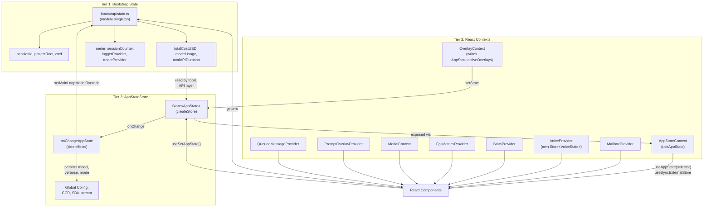

# State Management

> **Context:** Claude Code manages state across three tiers. Tier 1 is a plain
> module-level singleton that exists outside React. Tier 2 is a custom store
> (`Store<AppState>`) that bridges imperative code with the React render tree.
> Tier 3 is a set of narrowly scoped React contexts for UI concerns that do not
> belong in the central store. Understanding which tier owns a piece of data --
> and why -- is the key to navigating the state layer.

## Key Files

| File | Purpose |
|------|---------|
| [`source/src/bootstrap/state.ts`](../../source/src/bootstrap/state.ts) | Tier 1 -- process-global singleton (`STATE`). Session ID, cwd, cost accumulators, telemetry handles. |
| [`source/src/state/store.ts`](../../source/src/state/store.ts) | Generic `Store<T>` factory (`createStore`). |
| [`source/src/state/AppStateStore.ts`](../../source/src/state/AppStateStore.ts) | `AppState` type, `getDefaultAppState()`, `IDLE_SPECULATION_STATE`. |
| [`source/src/state/AppState.tsx`](../../source/src/state/AppState.tsx) | `AppStoreContext`, `AppStateProvider`, `useAppState()`, `useSetAppState()`. |
| [`source/src/state/onChangeAppState.ts`](../../source/src/state/onChangeAppState.ts) | Side-effect handler wired into `createStore`'s `onChange`. |
| [`source/src/state/selectors.ts`](../../source/src/state/selectors.ts) | Pure selectors: `getViewedTeammateTask()`, `getActiveAgentForInput()`. |
| [`source/src/context/stats.tsx`](../../source/src/context/stats.tsx) | `StatsProvider` / `useStats()` -- in-process metrics (counters, histograms, sets). |
| [`source/src/context/notifications.tsx`](../../source/src/context/notifications.tsx) | `useNotifications()` -- priority-queued toast system backed by `AppState.notifications`. |
| [`source/src/context/fpsMetrics.tsx`](../../source/src/context/fpsMetrics.tsx) | `FpsMetricsProvider` / `useFpsMetrics()` -- render frame-rate tracking. |
| [`source/src/context/mailbox.tsx`](../../source/src/context/mailbox.tsx) | `MailboxProvider` / `useMailbox()` -- cross-component message bus. |
| [`source/src/context/modalContext.tsx`](../../source/src/context/modalContext.tsx) | `ModalContext` / `useIsInsideModal()` / `useModalOrTerminalSize()` -- modal slot sizing. |
| [`source/src/context/overlayContext.tsx`](../../source/src/context/overlayContext.tsx) | `useRegisterOverlay()` / `useIsOverlayActive()` -- Escape-key coordination. |
| [`source/src/context/promptOverlayContext.tsx`](../../source/src/context/promptOverlayContext.tsx) | `PromptOverlayProvider` -- floating content above the prompt input. |
| [`source/src/context/QueuedMessageContext.tsx`](../../source/src/context/QueuedMessageContext.tsx) | `QueuedMessageProvider` / `useQueuedMessage()` -- queued message layout context. |
| [`source/src/context/voice.tsx`](../../source/src/context/voice.tsx) | `VoiceProvider` / `useVoiceState()` -- voice recording/processing state (ant-only, DCE'd for external builds). |

---

## Tier 1: Bootstrap State

**File:** `source/src/bootstrap/state.ts`

The bootstrap module is an **imperative, module-scoped singleton** (`const STATE: State = getInitialState()`). It exists for data that:

1. Must be available **before React mounts** (session ID is generated at import time via `randomUUID()`).
2. Is read by deep utility code that **must not import React** (the bootstrap module is a leaf in the import DAG -- it has no circular dependencies on application code).
3. Accumulates across the entire process lifetime regardless of UI state (cost, token usage, durations).

### What lives here

| Category | Fields (representative) |
|----------|------------------------|
| **Identity** | `sessionId`, `parentSessionId`, `originalCwd`, `projectRoot`, `cwd` |
| **Cost / Usage** | `totalCostUSD`, `totalAPIDuration`, `totalAPIDurationWithoutRetries`, `totalToolDuration`, `modelUsage`, `totalLinesAdded`, `totalLinesRemoved` |
| **Turn metrics** | `turnHookDurationMs`, `turnToolDurationMs`, `turnClassifierDurationMs`, `turnToolCount`, `turnHookCount`, `turnClassifierCount` |
| **Telemetry** | `meter`, `sessionCounter`, `locCounter`, `costCounter`, `tokenCounter`, `loggerProvider`, `eventLogger`, `tracerProvider`, `meterProvider` |
| **Model** | `mainLoopModelOverride`, `initialMainLoopModel`, `modelStrings` |
| **Session flags** | `isInteractive`, `kairosActive`, `clientType`, `sessionSource`, `isRemoteMode`, `sessionBypassPermissionsMode`, `sessionTrustAccepted` |
| **Cache / latching** | `promptCache1hEligible`, `afkModeHeaderLatched`, `fastModeHeaderLatched`, `thinkingClearLatched`, `systemPromptSectionCache` |
| **Hooks / plugins** | `registeredHooks`, `inlinePlugins`, `invokedSkills` |

All access goes through **exported getter/setter functions** (`getSessionId()`, `getCwdState()`, `addToTotalCostState()`, etc.) -- the `STATE` object is never exported directly.

### Why separate from React state

The bootstrap module is intentionally a non-reactive, non-subscribable object:

- **Import DAG safety:** It sits at the leaf of the module graph. Hundreds of files import it; if it imported React or AppState, circular dependencies would be immediate.
- **Process-scoped identity:** `sessionId` must be stable from the first line of `main.tsx` through shutdown hooks, before any provider mounts.
- **Performance accounting:** Cost/duration accumulators are written from deep API and tool-execution paths that have no access to React's `setState`.

---

## Tier 2: AppStateStore

### Store implementation

**File:** `source/src/state/store.ts`

`createStore<T>` returns a `Store<T>` with three methods:

```
type Store<T> = {
  getState: () => T
  setState: (updater: (prev: T) => T) => void
  subscribe: (listener: () => void) => () => void
}
```

Key behaviors:

- **`Object.is` equality bail-out:** If the updater returns the same reference (`Object.is(next, prev)`), no listeners fire and no `onChange` runs.
- **`onChange` callback:** An optional `(args: { newState, oldState }) => void` passed at creation time. This is how `onChangeAppState` hooks into state transitions.
- **Synchronous:** `setState` is synchronous. Callers can read `getState()` immediately after and observe the new value.

### AppState type

**File:** `source/src/state/AppStateStore.ts`

The `AppState` type contains all reactive application state. Most of it is wrapped in `DeepImmutable<...>` for compile-time immutability enforcement; a few fields that contain function types or mutable collections (e.g., `tasks`, `mcp`) sit outside the `DeepImmutable` wrapper.

`getDefaultAppState()` returns the initial value passed to `createStore`.

The fields are grouped below by functional area:

#### Session & Settings

| Field | Type | Purpose |
|-------|------|---------|
| `settings` | `SettingsJson` | Merged settings from all sources |
| `verbose` | `boolean` | Verbose output mode |
| `mainLoopModel` | `ModelSetting` | Active model alias/name or `null` for default |
| `mainLoopModelForSession` | `ModelSetting` | Session-scoped model override |
| `thinkingEnabled` | `boolean \| undefined` | Extended thinking toggle |
| `promptSuggestionEnabled` | `boolean` | Prompt suggestion feature toggle |
| `authVersion` | `number` | Incremented on login/logout to trigger re-fetch |
| `effortValue` | `EffortValue \| undefined` | Effort level setting |
| `fastMode` | `boolean \| undefined` | Fast mode toggle |
| `advisorModel` | `string \| undefined` | Server-side advisor model |

#### UI State

| Field | Type | Purpose |
|-------|------|---------|
| `statusLineText` | `string \| undefined` | Current status line content |
| `expandedView` | `'none' \| 'tasks' \| 'teammates'` | Which expanded panel is shown |
| `isBriefOnly` | `boolean` | Brief output mode |
| `selectedIPAgentIndex` | `number` | In-process agent selection index |
| `coordinatorTaskIndex` | `number` | CoordinatorTaskPanel selection (-1 = pill, 0 = main, 1..N = agent rows) |
| `viewSelectionMode` | `'none' \| 'selecting-agent' \| 'viewing-agent'` | Agent view selection state |
| `footerSelection` | `FooterItem \| null` | Which footer pill is focused |
| `spinnerTip` | `string \| undefined` | Spinner tooltip text |
| `activeOverlays` | `ReadonlySet<string>` | Active overlay IDs for Escape key coordination |

#### Agent & Identity

| Field | Type | Purpose |
|-------|------|---------|
| `agent` | `string \| undefined` | Agent name from `--agent` flag or settings |
| `kairosEnabled` | `boolean` | Assistant mode fully enabled |
| `agentDefinitions` | `AgentDefinitionsResult` | Loaded agent definitions (`activeAgents`, `allAgents`) |
| `standaloneAgentContext` | `{ name, color? } \| undefined` | Non-swarm custom agent identity |
| `companionReaction` | `string \| undefined` | Latest companion observer reaction |
| `companionPetAt` | `number \| undefined` | Timestamp of last `/buddy pet` |

#### Remote / Bridge

| Field | Type | Purpose |
|-------|------|---------|
| `remoteSessionUrl` | `string \| undefined` | Remote session URL for `--remote` mode |
| `remoteConnectionStatus` | `'connecting' \| 'connected' \| 'reconnecting' \| 'disconnected'` | Remote WS state |
| `remoteBackgroundTaskCount` | `number` | Background tasks in remote daemon |
| `replBridgeEnabled` | `boolean` | Always-on bridge desired state |
| `replBridgeExplicit` | `boolean` | True when activated via `/remote-control` |
| `replBridgeOutboundOnly` | `boolean` | Outbound-only mode |
| `replBridgeConnected` | `boolean` | Bridge env registered + session created |
| `replBridgeSessionActive` | `boolean` | Ingress WebSocket is open |
| `replBridgeReconnecting` | `boolean` | Poll loop in error backoff |
| `replBridgeConnectUrl` | `string \| undefined` | Connect URL for Ready state |
| `replBridgeSessionUrl` | `string \| undefined` | Session URL on claude.ai |
| `replBridgeEnvironmentId` | `string \| undefined` | Environment ID for debugging |
| `replBridgeSessionId` | `string \| undefined` | Session ID for debugging |
| `replBridgeError` | `string \| undefined` | Connection error message |
| `replBridgeInitialName` | `string \| undefined` | Session name from `/remote-control <name>` |
| `showRemoteCallout` | `boolean` | First-time remote dialog pending |
| `replBridgePermissionCallbacks` | `BridgePermissionCallbacks \| undefined` | Bidirectional permission callbacks |
| `channelPermissionCallbacks` | `ChannelPermissionCallbacks \| undefined` | Channel permission callbacks |

#### Tool Permissions

| Field | Type | Purpose |
|-------|------|---------|
| `toolPermissionContext` | `ToolPermissionContext` | Current permission mode, rules, and bypass state |
| `denialTracking` | `DenialTrackingState \| undefined` | Classifier-mode denial counters; falls back to prompting when exceeded |

#### Tasks & Agents

| Field | Type | Purpose |
|-------|------|---------|
| `tasks` | `{ [taskId: string]: TaskState }` | Unified task state (excluded from `DeepImmutable` -- contains function types) |
| `agentNameRegistry` | `Map<string, AgentId>` | Name-to-ID registry for `SendMessage` routing |
| `foregroundedTaskId` | `string \| undefined` | Task whose messages appear in main view |
| `viewingAgentTaskId` | `string \| undefined` | Teammate transcript being viewed |
| `teamContext` | `{ teamName, teammates, ... } \| undefined` | Team/swarm coordination state |
| `inbox` | `{ messages: Array<...> }` | Incoming messages from teammates |
| `initialMessage` | `{ message, clearContext?, mode?, allowedPrompts? } \| null` | Queued message from CLI args or plan mode exit |

#### MCP & Plugins

| Field | Type | Purpose |
|-------|------|---------|
| `mcp` | `{ clients, tools, commands, resources, pluginReconnectKey }` | MCP server connections and discovered tools/resources |
| `plugins` | `{ enabled, disabled, commands, errors, installationStatus, needsRefresh }` | Plugin lifecycle state |
| `sessionHooks` | `SessionHooksState` | Session-scoped hook state (a `Map`) |
| `elicitation` | `{ queue: ElicitationRequestEvent[] }` | MCP elicitation request queue |

#### Notifications & UI Overlays

| Field | Type | Purpose |
|-------|------|---------|
| `notifications` | `{ current: Notification \| null, queue: Notification[] }` | Priority-queued notification system |
| `promptSuggestion` | `{ text, promptId, shownAt, acceptedAt, generationRequestId }` | Prompt suggestion overlay state |
| `speculation` | `SpeculationState` | Speculative execution state (`'idle'` or `'active'` with abort handle) |
| `speculationSessionTimeSavedMs` | `number` | Cumulative time saved by speculation |
| `skillImprovement` | `{ suggestion: ... \| null }` | Pending skill improvement suggestion |

#### File & Attribution

| Field | Type | Purpose |
|-------|------|---------|
| `fileHistory` | `FileHistoryState` | File snapshots for undo (`snapshots`, `trackedFiles`, `snapshotSequence`) |
| `attribution` | `AttributionState` | Commit attribution tracking |
| `todos` | `{ [agentId: string]: TodoList }` | Per-agent todo lists |

#### Special Features

| Field | Type | Purpose |
|-------|------|---------|
| `tungstenActiveSession` | `{ sessionName, socketName, target } \| undefined` | Tmux integration session |
| `tungstenPanelVisible` | `boolean \| undefined` | Tmux panel visibility toggle |
| `tungstenPanelAutoHidden` | `boolean \| undefined` | Transient auto-hide at turn end |
| `tungstenLastCapturedTime` | `number \| undefined` | When tmux frame was captured |
| `tungstenLastCommand` | `{ command, timestamp } \| undefined` | Last tmux command display |
| `bagelActive` | `boolean \| undefined` | WebBrowser tool pill visible |
| `bagelUrl` | `string \| undefined` | WebBrowser current page URL |
| `bagelPanelVisible` | `boolean \| undefined` | WebBrowser panel visibility |
| `showTeammateMessagePreview` | `boolean \| undefined` | Teammate message preview (requires `ENABLE_AGENT_SWARMS`) |
| `replContext` | `{ vmContext, registeredTools, console } \| undefined` | REPL tool VM context persisted across calls |
| `ultraplanLaunching` | `boolean \| undefined` | Ultraplan launch in progress |
| `ultraplanSessionUrl` | `string \| undefined` | Active ultraplan CCR session URL |
| `ultraplanPendingChoice` | `{ plan, sessionId, taskId } \| undefined` | Approved ultraplan awaiting user choice |
| `ultraplanLaunchPending` | `{ blurb } \| undefined` | Pre-launch permission dialog state |
| `isUltraplanMode` | `boolean \| undefined` | Remote-harness ultraplan mode |
| `pendingPlanVerification` | `{ plan, verificationStarted, verificationCompleted } \| undefined` | Plan verification state |
| `remoteAgentTaskSuggestions` | `{ summary, task }[]` | Remote agent task suggestions |

#### Computer Use & Sandbox

| Field | Type | Purpose |
|-------|------|---------|
| `computerUseMcpState` | `{ allowedApps?, grantFlags?, lastScreenshotDims?, ... } \| undefined` | Computer use MCP session state (active when `feature('CHICAGO_MCP')` is on) |
| `workerSandboxPermissions` | `{ queue: Array<...>, selectedIndex }` | Worker sandbox network permission requests (leader side) |
| `pendingWorkerRequest` | `{ toolName, toolUseId, description } \| null` | Pending permission request on worker side |
| `pendingSandboxRequest` | `{ requestId, host } \| null` | Pending sandbox permission request on worker side |

---

## Tier 3: React Contexts

These contexts carry state that is either too transient, too UI-specific, or structurally incompatible with `AppState`.

| # | Context | File | Type | Key Exports | Purpose |
|---|---------|------|------|-------------|---------|
| 1 | `AppStoreContext` | `state/AppState.tsx` | `Store<AppState> \| null` | `useAppState(selector)`, `useSetAppState()`, `useAppStateStore()`, `useAppStateMaybeOutsideOfProvider(selector)` | Central store access; `useSyncExternalStore` for slice subscriptions |
| 2 | `StatsContext` | `context/stats.tsx` | `StatsStore \| null` | `StatsProvider`, `useStats()`, `useCounter(name)`, `useGauge(name)` | In-process counters, histograms (reservoir sampling), and sets; flushed to project config on process exit |
| 3 | `MailboxContext` | `context/mailbox.tsx` | `Mailbox \| undefined` | `MailboxProvider`, `useMailbox()` | Cross-component message bus (`Mailbox` utility instance) |
| 4 | `VoiceContext` | `context/voice.tsx` | `Store<VoiceState> \| null` | `VoiceProvider`, `useVoiceState(selector)`, `useSetVoiceState()`, `useGetVoiceState()` | Voice recording state (idle/recording/processing), interim transcript, audio levels. Uses its own `Store<VoiceState>` instance. DCE'd for external builds. |
| 5 | `FpsMetricsContext` | `context/fpsMetrics.tsx` | `FpsMetricsGetter \| undefined` | `FpsMetricsProvider`, `useFpsMetrics()` | Render frame-rate getter function for performance monitoring |
| 6 | `ModalContext` | `context/modalContext.tsx` | `{ rows, columns, scrollRef } \| null` | `useIsInsideModal()`, `useModalOrTerminalSize(fallback)`, `useModalScrollRef()` | Modal slot geometry; prevents overflow in `FullscreenLayout`'s bottom pane |
| 7 | `OverlayContext` (AppState-backed) | `context/overlayContext.tsx` | Writes to `AppState.activeOverlays` | `useRegisterOverlay(id, enabled?)`, `useIsOverlayActive()` | Tracks active overlays (Select dialogs) so `CancelRequestHandler` distinguishes Escape-to-dismiss from Escape-to-cancel |
| 8 | `PromptOverlayContext` | `context/promptOverlayContext.tsx` | `PromptOverlayData \| null` + `ReactNode` (dialog) | `PromptOverlayProvider`, `usePromptOverlay()`, `useSetPromptOverlay(data)`, `usePromptOverlayDialog()`, `useSetPromptOverlayDialog(node)` | Portal for floating content above the prompt; escapes `FullscreenLayout`'s `overflowY:hidden` clip. Split into data/setter context pairs so writers never re-render on their own writes. |
| 9 | `QueuedMessageContext` | `context/QueuedMessageContext.tsx` | `{ isQueued, isFirst, paddingWidth } \| undefined` | `QueuedMessageProvider`, `useQueuedMessage()` | Layout context for queued message rendering (padding, first-in-queue flag) |

---

## State Change Handlers

**File:** `source/src/state/onChangeAppState.ts`

`onChangeAppState` is passed as the `onChange` callback when the `AppStateStore` is created. It fires synchronously after every `setState` call that passes the `Object.is` check. It implements several side effects:

1. **Permission mode sync** (`toolPermissionContext.mode`): When the mode changes, the handler notifies CCR (`notifySessionMetadataChanged`) and the SDK status stream (`notifyPermissionModeChanged`). This is the single choke point -- prior to this handler, only 2 of 8+ mutation paths relayed mode changes. The handler externalizes mode names before sending (e.g., `'bubble'` externalizes to `'default'`, so CCR only sees external mode names) and includes ultraplan flags when relevant.

2. **Model persistence** (`mainLoopModel`): When the model changes to `null`, it is removed from user settings and the bootstrap model override is cleared. When changed to a non-null value, it is saved to user settings and the override is set.

3. **Expanded view persistence** (`expandedView`): Persists the current view state (`'tasks'` / `'teammates'` / `'none'`) as two boolean flags (`showExpandedTodos`, `showSpinnerTree`) in global config for backward compatibility.

4. **Verbose persistence** (`verbose`): Syncs the verbose flag to global config.

5. **Tungsten panel visibility** (`tungstenPanelVisible`): Persists the tmux panel toggle to global config (ant-only).

6. **Settings change** (`settings`): Clears auth-related caches (`clearApiKeyHelperCache`, `clearAwsCredentialsCache`, `clearGcpCredentialsCache`). When `settings.env` changes, re-applies managed environment variables via `applyConfigEnvironmentVariables()`.

There is also an inverse function, `externalMetadataToAppState`, which converts external metadata (from a worker restart or control request) back into an `AppState` updater.

---

## Selectors

**File:** `source/src/state/selectors.ts`

Selectors are pure functions that derive computed values from `AppState`. They contain no side effects.

### `getViewedTeammateTask(appState)`

Returns the `InProcessTeammateTaskState` for the currently viewed teammate, or `undefined` if:
- `viewingAgentTaskId` is unset
- The task ID does not exist in `tasks`
- The task is not an in-process teammate task (checked via `isInProcessTeammateTask`)

Accepts a narrow pick type: `Pick<AppState, 'viewingAgentTaskId' | 'tasks'>`.

### `getActiveAgentForInput(appState)`

Determines where user input should be routed. Returns a discriminated union (`ActiveAgentForInput`):

| Variant | When | Meaning |
|---------|------|---------|
| `{ type: 'leader' }` | Not viewing any teammate | Input goes to the leader agent |
| `{ type: 'viewed', task }` | Viewing an in-process teammate | Input goes to that teammate |
| `{ type: 'named_agent', task }` | Viewing a local agent task | Input goes to that named agent |

Internally delegates to `getViewedTeammateTask` first, then checks for `local_agent` task type as a fallback.

---

## Provider Nesting Order

`AppStateProvider` owns the nesting of the two providers it depends on. Inside `AppStateProvider` the JSX is:

```
<HasAppStateContext.Provider>
  <AppStoreContext.Provider>
    <MailboxProvider>
      <VoiceProvider>
        {children}
      </VoiceProvider>
    </MailboxProvider>
  </AppStoreContext.Provider>
</HasAppStateContext.Provider>
```

`VoiceProvider` is conditionally loaded via `feature('VOICE_MODE')` -- external builds get a passthrough component that renders `children` directly.

The remaining contexts (`StatsProvider`, `FpsMetricsProvider`, `PromptOverlayProvider`, `ModalContext`, etc.) are mounted further up or further down in the component tree by the app shell and layout components, not by `AppStateProvider`.

`AppStateProvider` includes a guard (`HasAppStateContext`) that throws if you try to nest one provider inside another.

---

## Diagram



**Read/write flow summary:**
- **Bootstrap state** is written by deep utility code (API client, tool executor, CLI setup) and read by both React components and non-React code.
- **AppStateStore** is the reactive hub: written via `useSetAppState()` from React or `store.setState()` from imperative code; read via `useAppState(selector)` which subscribes through `useSyncExternalStore`.
- **React Contexts** either wrap the central store (AppStoreContext, OverlayContext) or manage independent state (VoiceProvider has its own `Store<VoiceState>`, StatsProvider has its own `StatsStore`).
- **`onChangeAppState`** is the bridge that propagates selected state changes outward to global config, CCR metadata, SDK streams, and bootstrap overrides.
