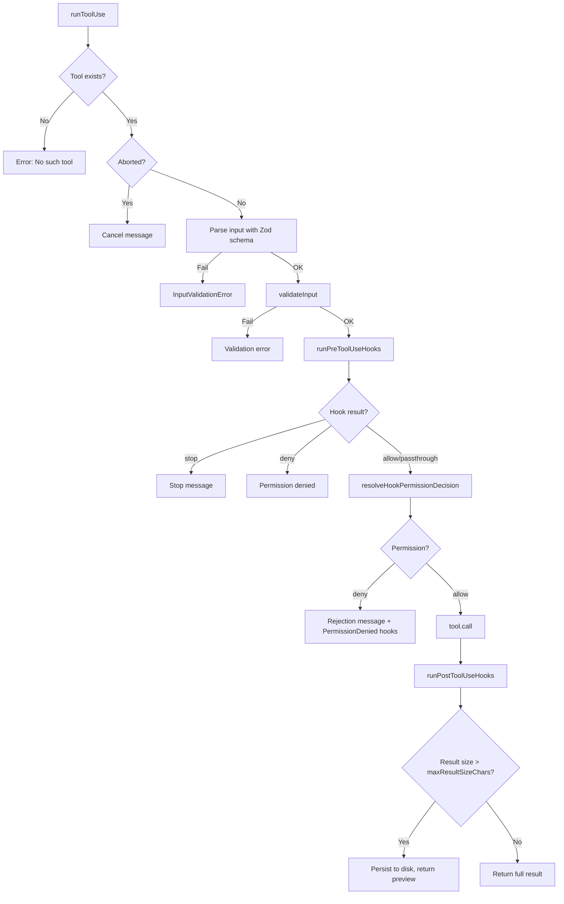
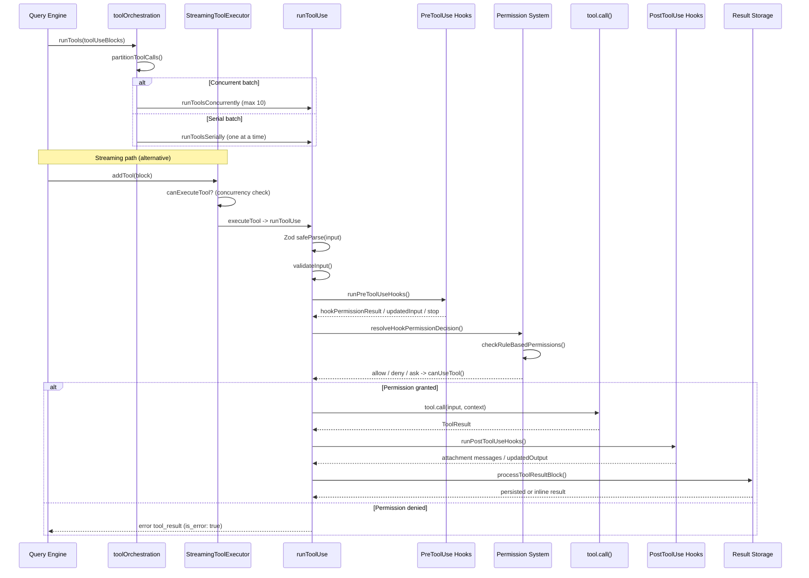

# Tool System

> Tools are Claude Code's interface with the outside world. Every file read, shell command, web search, and code edit passes through the tool system -- a pipeline that defines tool capabilities, validates inputs, enforces permissions, and orchestrates concurrent execution. This page covers the full lifecycle from tool definition to result delivery. For where the tool system sits in the broader architecture, see [Architecture Overview](architecture-overview.md). For how the query engine invokes tools each turn, see [Query Engine](query-engine.md).

## Key Files

| File | Purpose |
|------|---------|
| `src/Tool.ts` | Core type definitions: `Tool`, `ToolUseContext`, `ToolResult`, `ValidationResult`, `ToolPermissionContext`, `buildTool()` |
| `src/tools.ts` | Tool registry: `getAllBaseTools()`, `getTools()`, `assembleToolPool()`, `getMergedTools()`, feature-gated conditional imports |
| `src/services/tools/toolExecution.ts` | `runToolUse()` -- single tool execution flow: find, validate, check permissions, call, persist results |
| `src/services/tools/toolOrchestration.ts` | `runTools()` -- batch partitioning into concurrent vs serial batches, concurrency control |
| `src/services/tools/StreamingToolExecutor.ts` | `StreamingToolExecutor` class -- concurrent execution with `TrackedTool` state machine, sibling abort on Bash errors |
| `src/services/tools/toolHooks.ts` | `runPreToolUseHooks()`, `runPostToolUseHooks()`, `resolveHookPermissionDecision()` -- hook-based permission overrides |
| `src/constants/toolLimits.ts` | Size constants: `DEFAULT_MAX_RESULT_SIZE_CHARS` (50K), `MAX_TOOL_RESULT_BYTES` (400KB), `MAX_TOOL_RESULTS_PER_MESSAGE_CHARS` (200K) |
| `src/utils/toolResultStorage.ts` | `persistToolResult()`, `processToolResultBlock()` -- disk persistence for oversized results |
| `src/utils/forkedAgent.ts` | `createSubagentContext()` -- isolated `ToolUseContext` for spawned agents |

## Tool Type Anatomy

Every tool is created through `buildTool()`, which takes a partial `ToolDef` and returns a complete `Tool` object with safe defaults. The `Tool` type has approximately 40 members, grouped here by purpose.

### Identity

| Member | Type | Notes |
|--------|------|-------|
| `name` | `string` (readonly) | Primary name, used for lookup and API wire format |
| `aliases` | `string[]` (optional) | Backwards-compatible names when a tool is renamed |
| `searchHint` | `string` (optional) | 3--10 word phrase for `ToolSearch` keyword matching |

### Schema

| Member | Type | Notes |
|--------|------|-------|
| `inputSchema` | `z.ZodType` (readonly) | Zod v4 schema; `safeParse()` is the first validation gate |
| `inputJSONSchema` | `ToolInputJSONSchema` (optional) | Raw JSON Schema for MCP tools that skip Zod conversion |
| `outputSchema` | `z.ZodType` (optional) | Currently optional -- not all tools define this |
| `inputsEquivalent` | `(a, b) => boolean` (optional) | Deduplication check for equivalent inputs |

### Execution

| Member | Type | Notes |
|--------|------|-------|
| `call()` | `(args, context, canUseTool, parentMessage, onProgress?) => Promise<ToolResult>` | The main execution entry point |
| `validateInput()` | `(input, context) => Promise<ValidationResult>` (optional) | Tool-specific validation beyond schema; runs before permissions |
| `checkPermissions()` | `(input, context) => Promise<PermissionResult>` | Tool-specific permission logic; runs after `validateInput()` |
| `maxResultSizeChars` | `number` | Per-tool persistence threshold; `Infinity` for tools like `Read` that self-bound |

### Classification & Concurrency

| Member | Type | `buildTool()` Default |
|--------|------|-----------------------|
| `isEnabled()` | `() => boolean` | `() => true` |
| `isConcurrencySafe()` | `(input) => boolean` | `() => false` (assume not safe) |
| `isReadOnly()` | `(input) => boolean` | `() => false` (assume writes) |
| `isDestructive()` | `(input) => boolean` | `() => false` |
| `interruptBehavior()` | `() => 'cancel' \| 'block'` (optional) | Not set; defaults to `'block'` at call sites |

### Presentation & Prompt

| Member | Purpose |
|--------|---------|
| `description()` | One-line description for model context |
| `prompt()` | Full system prompt instructions for this tool |
| `userFacingName()` | Human-readable label (default: tool `name`) |
| `toAutoClassifierInput()` | Compact representation for the auto-mode security classifier (default: `''` -- skip) |
| `getActivityDescription()` | Present-tense spinner text ("Reading src/foo.ts") |
| `getToolUseSummary()` | Short string for compact/grouped views |

### Rendering

| Member | Purpose |
|--------|---------|
| `renderToolUseMessage()` | Render the tool invocation (input may be partial during streaming) |
| `renderToolResultMessage()` | Render the tool output (optional -- omit for tools with no visible result) |
| `renderToolUseProgressMessage()` | Progress UI while tool runs (optional) |
| `renderToolUseRejectedMessage()` | Custom rejection UI (optional; falls back to `FallbackToolUseRejectedMessage`) |
| `renderToolUseErrorMessage()` | Custom error UI (optional; falls back to `FallbackToolUseErrorMessage`) |
| `renderGroupedToolUse()` | Render multiple parallel instances as a group (non-verbose only) |
| `mapToolResultToToolResultBlockParam()` | Serialize output to API `ToolResultBlockParam` format |

### Advanced

| Member | Purpose |
|--------|---------|
| `backfillObservableInput()` | Mutate a clone of input before hooks/observers see it; original is preserved for `call()` |
| `preparePermissionMatcher()` | Build a closure for hook `if`-condition pattern matching (e.g., `"Bash(git *)"`) |
| `shouldDefer` | When `true`, schema is omitted until `ToolSearch` loads it |
| `alwaysLoad` | When `true`, schema is never deferred (overrides `shouldDefer`) |
| `isMcp` / `isLsp` | Protocol flags for MCP and LSP tools |
| `mcpInfo` | Original server+tool names for MCP tools (pre-normalization) |
| `strict` | Enables stricter API adherence to schema |

### buildTool() Defaults

`buildTool()` applies fail-closed defaults so callers never need `?.() ?? default`:

```typescript
const TOOL_DEFAULTS = {
  isEnabled:          () => true,
  isConcurrencySafe:  () => false,   // assume not safe
  isReadOnly:         () => false,   // assume writes
  isDestructive:      () => false,
  checkPermissions:   (input) => Promise.resolve({ behavior: 'allow', updatedInput: input }),
  toAutoClassifierInput: () => '',   // skip classifier
  userFacingName:     () => name,    // falls back to tool name
}
```

A `ToolDef` (the input to `buildTool()`) makes all of these optional. The resulting `Tool` always has them.

## ToolUseContext Deep Dive

`ToolUseContext` is the environment object threaded through every tool call. It is large by design -- it is the single conduit through which tools interact with application state, UI, permissions, abort signaling, and more. Grouping by category:

### Options & Configuration

| Field | Purpose |
|-------|---------|
| `options.tools` | The active tool pool for this turn |
| `options.commands` | Registered CLI commands |
| `options.mainLoopModel` | Model ID for the current conversation |
| `options.thinkingConfig` | Extended thinking configuration |
| `options.mcpClients` | Connected MCP server connections |
| `options.mcpResources` | MCP resource registry |
| `options.isNonInteractiveSession` | `true` for SDK/print mode (no interactive prompts) |
| `options.agentDefinitions` | Available agent types from `agents/` directories |
| `options.maxBudgetUsd` | Spending cap for the session |
| `options.customSystemPrompt` / `appendSystemPrompt` | System prompt overrides |
| `options.refreshTools` | Callback to re-fetch tools mid-query (e.g., after MCP server connects) |

### Abort & Lifecycle

| Field | Purpose |
|-------|---------|
| `abortController` | Per-tool or per-query `AbortController`; checked before and during tool execution |
| `setInProgressToolUseIDs` | Tracks which tool_use IDs are currently executing |
| `setHasInterruptibleToolInProgress` | Signals whether the user can cancel via ESC (REPL only) |

### State Access

| Field | Purpose |
|-------|---------|
| `getAppState()` | Read the Zustand `AppState` snapshot |
| `setAppState()` | Mutate `AppState` (no-op for async subagents) |
| `setAppStateForTasks` | Always-shared mutation callback that outlives a single turn (for background tasks) |
| `messages` | The conversation message array for this context |

### File & Cache

| Field | Purpose |
|-------|---------|
| `readFileState` | `FileStateCache` -- LRU cache for file contents (cloned per subagent) |
| `updateFileHistoryState` | Tracks file modifications for undo/attribution |
| `updateAttributionState` | Commit attribution tracking |
| `fileReadingLimits` | Max tokens / max bytes caps for file reads |
| `globLimits` | Max results cap for glob operations |

### UI & JSX

| Field | Purpose |
|-------|---------|
| `setToolJSX` | Render custom JSX into the tool output region |
| `setStreamMode` | Control spinner mode |
| `addNotification` | Push notifications to the notification tray |
| `appendSystemMessage` | Inject UI-only system messages (stripped at API boundary) |
| `sendOSNotification` | Fire OS-level notifications (iTerm2, Kitty, Ghostty, bell) |
| `setSDKStatus` | Push status updates to SDK consumers |

### Hooks & Permissions

| Field | Purpose |
|-------|---------|
| `toolDecisions` | Map of tool_use_id to permission decisions (source + accept/reject) |
| `requestPrompt` | Callback factory for interactive prompts from the user (REPL only) |
| `requireCanUseTool` | Force `canUseTool` even when hooks auto-approve (speculation path) |
| `localDenialTracking` | Mutable denial counter for async subagents whose `setAppState` is a no-op |

### Agent Context

| Field | Purpose |
|-------|---------|
| `agentId` | Set for subagents; used by hooks to distinguish subagent calls |
| `agentType` | Subagent type name (e.g., `"code"`, `"research"`) |
| `queryTracking` | Chain ID + depth for nested agent tracking |
| `preserveToolUseResults` | Keep `toolUseResult` on messages for in-process teammates with viewable transcripts |

### Budgets & Result Management

| Field | Purpose |
|-------|---------|
| `contentReplacementState` | Per-conversation-thread state for the aggregate tool result budget |
| `renderedSystemPrompt` | Parent's system prompt bytes, frozen at turn start (prompt cache sharing for forks) |

### Memory & Skill Triggers

| Field | Purpose |
|-------|---------|
| `nestedMemoryAttachmentTriggers` | Trigger patterns for CLAUDE.md injection |
| `loadedNestedMemoryPaths` | Dedup set for already-injected CLAUDE.md paths |
| `dynamicSkillDirTriggers` | Trigger patterns for dynamic skill discovery |
| `discoveredSkillNames` | Skills surfaced via `skill_discovery` (telemetry) |

**Why is it so large?** `ToolUseContext` serves as a universal dependency injection bag. Tools cannot import application state directly (they run in varying contexts -- REPL, SDK, subagents, coordinators). Rather than maintaining separate context types for each environment, the system uses a single type with optional fields. Subagent isolation is achieved through `createSubagentContext()`, which clones mutable state and no-ops mutation callbacks, rather than requiring a separate type.

## Tool Registration

### getAllBaseTools(): The Source of Truth

`getAllBaseTools()` in `src/tools.ts` returns the exhaustive list of all tools available in the current environment. It is the single source of truth for tool registration.

The function returns a flat array that mixes three categories:

1. **Always-available tools** -- imported statically at module top level (e.g., `BashTool`, `FileReadTool`, `FileEditTool`, `GlobTool`, `AgentTool`)
2. **Feature-gated tools** -- imported via conditional `require()` guarded by `feature()` flags from `bun:bundle` or `process.env` checks
3. **Lazy-loaded tools** -- wrapped in getter functions to break circular dependencies (e.g., `getTeamCreateTool()`, `getSendMessageTool()`)

### Feature-Gated Conditional Import Pattern

Feature-gated tools use a characteristic pattern that enables dead code elimination in production builds:

```typescript
const SleepTool = feature('PROACTIVE') || feature('KAIROS')
  ? require('./tools/SleepTool/SleepTool.js').SleepTool
  : null

// Later in getAllBaseTools():
...(SleepTool ? [SleepTool] : []),
```

The `feature()` function from `bun:bundle` is evaluated at build time. When a feature flag is `false`, the bundler can eliminate the `require()` entirely. The `process.env.USER_TYPE === 'ant'` checks gate Anthropic-internal tools (REPLTool, ConfigTool, TungstenTool, SuggestBackgroundPRTool).

Notable feature-gated tools include:
- `REPLTool` -- `USER_TYPE === 'ant'`
- `SleepTool` -- `PROACTIVE` or `KAIROS`
- `cronTools` (CronCreate/Delete/List) -- `AGENT_TRIGGERS`
- `WebBrowserTool` -- `WEB_BROWSER_TOOL`
- `WorkflowTool` -- `WORKFLOW_SCRIPTS`
- `SnipTool` -- `HISTORY_SNIP`
- `ToolSearchTool` -- `isToolSearchEnabledOptimistic()`

### getTools(): Filtering

`getTools(permissionContext)` applies three layers of filtering on top of `getAllBaseTools()`:

1. **Simple mode** (`CLAUDE_CODE_SIMPLE`): Returns only Bash, FileRead, FileEdit (plus AgentTool/TaskStopTool if coordinator mode is active)
2. **Deny-rule filtering** (`filterToolsByDenyRules`): Removes tools blanket-denied by the `ToolPermissionContext` -- a deny rule matching a tool name with no `ruleContent` strips it before the model sees it
3. **REPL mode filtering**: When `REPLTool` is enabled, primitive tools it wraps (listed in `REPL_ONLY_TOOLS`) are hidden from direct model access
4. **isEnabled() check**: Each tool's `isEnabled()` is called; disabled tools are excluded

### assembleToolPool(): Dedup and Sort

`assembleToolPool(permissionContext, mcpTools)` is the single source of truth for the final tool pool sent to the API:

1. Gets built-in tools via `getTools()`
2. Filters MCP tools by deny rules
3. Sorts each partition alphabetically by name for **prompt-cache stability** (built-ins as a contiguous prefix, MCP tools as a suffix)
4. Deduplicates via `lodash.uniqBy('name')` -- built-in tools take precedence on name collision

### getMergedTools()

`getMergedTools()` is a simpler variant that combines built-in and MCP tools without deduplication or sorting. Used for tool-count calculations (e.g., `isToolSearchEnabled` threshold).

## Execution Lifecycle

The tool execution pipeline has two entry points depending on whether tools stream in one at a time or arrive as a batch.

### Batch Path: toolOrchestration.ts

`runTools()` is the batch entry point used by the query engine for non-streaming tool execution:

```
runTools(toolUseBlocks, assistantMessages, canUseTool, context)
  -> partitionToolCalls()     // split into concurrent vs serial batches
  -> for each batch:
       if concurrent:  runToolsConcurrently()  // parallel via all() with max concurrency
       if serial:      runToolsSerially()      // one at a time
```

`partitionToolCalls()` groups consecutive tool calls by concurrency safety. A tool is concurrency-safe if `tool.isConcurrencySafe(parsedInput)` returns `true` (e.g., read-only operations). Consecutive concurrency-safe tools are grouped into a single batch; non-concurrent tools each get their own batch.

The max concurrency is controlled by `CLAUDE_CODE_MAX_TOOL_USE_CONCURRENCY` (default: **10**).

### Streaming Path: StreamingToolExecutor

`StreamingToolExecutor` handles tools that arrive incrementally during response streaming. It maintains a queue of `TrackedTool` objects, each progressing through states:

**TrackedTool states**: `queued` -> `executing` -> `completed` -> `yielded`

The executor enforces the same concurrency rules as the batch path:
- Concurrent-safe tools may execute in parallel with each other
- A non-concurrent tool must execute alone (exclusive access)
- Results are buffered and emitted in the order tools were received (preserving transcript ordering)

**Sibling abort on Bash error**: When a `Bash` tool call produces an error result, the executor aborts all sibling tools via a shared `siblingAbortController`. This reflects the observation that Bash commands often have implicit dependency chains (e.g., `mkdir` fails means subsequent commands are pointless). Non-Bash tool errors do not trigger sibling abort -- `Read`, `WebFetch`, etc. are considered independent.

### Single Tool: runToolUse()

`runToolUse()` in `toolExecution.ts` handles the full lifecycle of a single tool invocation:



The detailed sequence within `checkPermissionsAndCallTool()`:

1. **Zod parse** -- `tool.inputSchema.safeParse(input)`. If this fails for a deferred tool whose schema was never loaded, a hint is appended telling the model to call `ToolSearch` first.
2. **validateInput()** -- Tool-specific validation (e.g., path traversal checks, argument constraints). Returns `ValidationResult` with error code.
3. **Speculative classifier start** -- For `Bash` tool, speculatively starts the allow-classifier check in parallel with hooks and permission resolution.
4. **backfillObservableInput()** -- Shallow-clones input and backfills legacy/derived fields for hooks/observers. The original input is preserved for `call()`.
5. **runPreToolUseHooks()** -- Fires `PreToolUse` hooks which can: allow, deny, ask, modify input, inject additional context, or stop execution entirely.
6. **resolveHookPermissionDecision()** -- Merges hook permission result with rule-based permissions. Key invariant: hook `allow` does NOT bypass settings.json deny/ask rules.
7. **canUseTool()** -- Interactive permission prompt (if needed). Produces a `PermissionDecision`.
8. **tool.call()** -- Actual execution. Receives the `ToolUseContext` with `toolUseId` injected.
9. **runPostToolUseHooks()** -- Fires `PostToolUse` hooks which can: inject additional context, modify MCP tool output, prevent continuation, or block.
10. **Result processing** -- `processPreMappedToolResultBlock()` or `processToolResultBlock()` handles persistence of oversized results.

### Full Pipeline Mermaid Diagram



## Permission Model

The permission system is layered, with multiple decision points evaluated in order.

### ToolPermissionContext

`ToolPermissionContext` (defined in `Tool.ts`) carries all permission state for a given session:

| Field | Purpose |
|-------|---------|
| `mode` | `'default'` (ask for dangerous ops), `'auto'` (classifier-based), or `'bypassPermissions'` |
| `alwaysAllowRules` | Rules keyed by source (session, localSettings, userSettings, etc.) that auto-approve |
| `alwaysDenyRules` | Rules that unconditionally deny |
| `alwaysAskRules` | Rules that force a prompt even in auto mode |
| `additionalWorkingDirectories` | Extra directories the user has authorized |
| `isBypassPermissionsModeAvailable` | Whether the user can escalate to bypass mode |
| `shouldAvoidPermissionPrompts` | `true` for background agents that cannot show UI |
| `awaitAutomatedChecksBeforeDialog` | `true` for coordinator workers -- await classifier before showing dialog |
| `prePlanMode` | Stashed permission mode for restoring after plan mode exits |

### Permission Resolution Flow

1. **tool.checkPermissions()** -- Tool-specific logic. Default from `buildTool()` is `{ behavior: 'allow' }` (defer to general system).
2. **PreToolUse hooks** -- Can return `permissionBehavior: 'allow' | 'deny' | 'ask'` with optional `updatedInput`.
3. **resolveHookPermissionDecision()** -- Merges hook result with rule-based permissions:
   - Hook `allow` + no conflicting rule = allow (skip interactive prompt)
   - Hook `allow` + deny rule = **deny wins** (settings.json deny rules cannot be overridden by hooks)
   - Hook `allow` + ask rule = ask (dialog still shown despite hook approval)
   - Hook `deny` = deny
   - Hook `ask` = pass `forceDecision` to `canUseTool()` so dialog shows hook's message
4. **canUseTool()** -- Interactive permission prompt (or auto-mode classifier decision).
5. **PermissionDenied hooks** -- For auto-mode classifier denials, `PermissionDenied` hooks can indicate the command is now approved (retry allowed).

### Deny Rules

Deny rules in `ToolPermissionContext.alwaysDenyRules` serve double duty:

- **At registration time**: `filterToolsByDenyRules()` strips blanket-denied tools (name match with no `ruleContent`) before the model sees them in the tool list.
- **At execution time**: `checkRuleBasedPermissions()` applies pattern-matched deny rules (e.g., `Bash(rm -rf *)`) even if hooks approve.

## Result Budgeting

Tool results are budgeted at two levels to prevent context window exhaustion.

### Per-Tool Limit

Each tool declares `maxResultSizeChars`. When the serialized result exceeds this threshold, `processToolResultBlock()` persists the full content to disk via `persistToolResult()` and returns a preview with the file path. Key values:

| Tool | `maxResultSizeChars` |
|------|---------------------|
| `FileReadTool` | `Infinity` (self-bounds via `maxTokens`) |
| `GrepTool` | 20,000 |
| `BashTool` | 30,000 |
| Most tools | 100,000 |
| System default | `DEFAULT_MAX_RESULT_SIZE_CHARS` = 50,000 |

The global hard cap is `MAX_TOOL_RESULT_BYTES` = 400KB (100K tokens * 4 bytes/token).

### Per-Message Aggregate Limit

When multiple tools execute in parallel, their combined results in a single user message are capped at `MAX_TOOL_RESULTS_PER_MESSAGE_CHARS` (200,000 characters). This prevents N parallel tools from each hitting their per-tool max and collectively producing an oversized message. The largest blocks are persisted first until the aggregate is under budget.

### Persistence Mechanism

`persistToolResult()` writes content to a file keyed by `tool_use_id`. The model receives:

```xml
<persisted-output>
[preview of first ~N characters]
...
Full output saved to: /path/to/persisted/file
</persisted-output>
```

The `contentReplacementState` on `ToolUseContext` tracks which tool results have been persisted across the conversation thread, enabling consistent re-replacement on conversation resume and prompt cache stability across forked subagents.

## Agent Tool Subprocess Model

`AgentTool` spawns isolated agents (subprocesses in the conceptual sense -- they are in-process async tasks, not OS processes) that run their own query loops.

### Spawn Flow

1. `AgentTool.call()` resolves the agent definition (built-in or user-defined from `agents/` directories)
2. `resolveAgentTools()` selects the tool set for the agent type (agents have restricted tool access -- e.g., `ALL_AGENT_DISALLOWED_TOOLS`)
3. `runAgent()` calls `createSubagentContext()` to build an isolated `ToolUseContext`
4. The agent runs `query()` -- the same query engine loop as the main thread -- with its own messages, tools, and system prompt

### Isolation via createSubagentContext()

`createSubagentContext()` in `src/utils/forkedAgent.ts` creates an isolated context. By default, ALL mutable state is isolated:

| Aspect | Default Behavior |
|--------|-----------------|
| `readFileState` | **Cloned** from parent |
| `abortController` | **New child** linked to parent (parent abort propagates down) |
| `getAppState` | **Wrapped** to set `shouldAvoidPermissionPrompts: true` |
| `setAppState` | **No-op** (async agents cannot mutate parent state) |
| `nestedMemoryAttachmentTriggers` | **Fresh** empty set |
| `toolDecisions` | **Undefined** (own decision tracking) |
| `contentReplacementState` | **Cloned** from parent (cache-sharing forks need identical decisions) |

Callers can opt in to sharing specific callbacks:
- `shareSetAppState: true` -- sync agents share state mutations with parent
- `shareSetResponseLength: true` -- both sync and async contribute to response metrics
- `shareAbortController: true` -- interactive subagents that should abort with parent

### Sync vs Async Agents

- **Sync agents**: Share `setAppState` and `abortController` with parent. Block the parent's query loop until complete.
- **Async (background) agents**: Fully isolated. Run independently, persist transcripts via sidechain records. Cannot show permission prompts (auto-denied or `shouldAvoidPermissionPrompts`).
